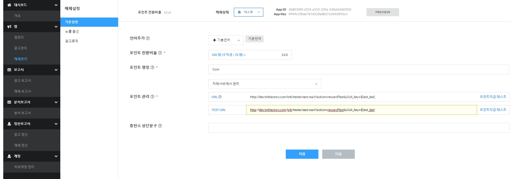

# Tnkfactory SDK Rwd

## Table Of Contents

1. [SDK Get Stared](#1-SDK-Get-Stared)

   * [Add SDK Library](#Add-SDK-Liblary) 
   * [AndropidManifest configurations](#AndroidManifest-configurations)
     * [Application ID Settings](#Application-ID-Settings)
     * [Add mandatory permissions](#Permissions-Settingss)
     * [Add Activity Tag](#Add-Activity-Tag)
   * [Proguard settings](#Proguard-settings)
   * [COPPA settings](#COPPA-settings)

2. [Show Ads List](#2-Show-Ads-List)
   
3. [Publisher API](#3-publisher-api)

   A. [Output ads list](#A-Output-ads-list)
   
   * [SetUp user identification](#Set-Up-user-identification)
     * [Method](#method)
     * [Parameters](#parameters)
   * [Show ads list(Activity)](#Show-ads-list-activity)
     * [Method](#method-1)
     * [Description](#description)
     * [Parameters](#parameters-1)
     * [Example](#Example)
   * [Show Ads List (View)](#Show-Ads-List-view)
     * [Method](#method-2)
     * [Description](#description-1)
     * [Parameters](#parameters-2)
     * [Example](#Example-1)
   * [Show MultiTab List (Activity)](#Show-MultiTab-List-Activity)
     * [Method](#method-3)
     * [Description](#description-2)
     * [Parameters](#parameters-3)
     * [Example](#Example-2)
   * [AdListView](#adlistview)
     * [Method](#method-4)
     * [Parameters](#parameters-4)
     * [Popup Sample](#popup-sample)
     * [Embed Sample](#embed-sample)
   * [AdListTabView](#adlisttabview)
     * [Method](#method-5)
     * [Parameters](#parameters-5)
     * [Embed Sample](#embed-sample-1)
   * [Use Listener](#Use-Listener)

   B. [Point lookup and withdrawal](#B-Point-lookup-and-withdrawal)

      * [TnkSession.queryPoint()](#tnksessionquerypoint)

   * [TnkSession.purchaseItem()](#tnksessionpurchaseitem)
   * [TnkSession.withdrawPoints()](#tnksessionwithdrawpoints)
   * [TnkSession.getEarnPoints()](#tnksessiongetearnpoints)

   C. [Other Methods](#C-other-Methods)

   * [TnkSession.queryPublishState()](#tnksessionquerypublishstate)
   * [TnkSession.queryAdvertiseCount()](#tnksessionqueryadvertisecount)
   * [TnkSession.enableLogging()](#tnksessionenablelogging)
   * [TnkSession.setAgreePrivacy()](#tnksessionsetagreeprivacy)

   D. [Modify Design](#D-Modify-Design)

     * [TnkLayout](#TnkLayout)
       * [TnkLayout ObJect](#TnkLayout-ObJect)
       * [Example](#Example-7)
      * [Templete Design](#Templete-Design)
           * [Example](#사Example)
           * [Templete Design](#Template-Design)
      * [ContactUs Style Modify Implement Close Button Method](#ContactUs-Style-Modify-Implement-Close-Button-Method)
        * [Implementation method](#Implementation-method)
        * [Example](#Example-8)

   E. [Callback URL](#E-callback-url)

   * [Call Method](#Call-method)
   * [Parameters](#parameters-15)
   * [Return data ](#Return-value-processing)
   * [Implement Callback URL Example (Java)](#Implement-Callback-URL-Example-Java)

4. [Analytics Report](#4-analytics-report)

   * [Basic Setting](#Basic-Setting)
   * [Initialize TNK SDK](#Initialize-TNK-SDK)
     * [Method](#method)
     * [Parameters](#parameters)
   * [Use Activity Analysis](#Use-Activity-Analysis)
     * [TnkSession.actionCompleted()](#tnksessionactioncompleted)
   * [Purchase Activity Analysis](#Purchase-Activity-Analysis)
     * [TnkSession.buyCompleted()](#tnksessionbuycompleted)
   * [User Information Settings](#User-Information-Settings)

   

## 1. SDK Get Stared

### Add SDK Liblary
In your project-level build.gradle file, include TNK SDK's Maven repository and Maven central repository in both your buildscript and allprojects sections:

```gradle
pluginManagement {
    repositories {
        gradlePluginPortal()
        google()
        mavenCentral()
    }
}
dependencyResolutionManagement {
    repositoriesMode.set(RepositoriesMode.FAIL_ON_PROJECT_REPOS)
    repositories {
        google()
        mavenCentral()
    }
}
rootProject.name = "project_name"
include ':app'
```

Add the dependencies for the TNK SDK to your module's app-level Gradle file, normally app/build.gradle:
```gradle
dependencies {
    implementation 'com.tnkfactory:rwd:7.xx.x'
}
```
### AndroidManifest configurations

#### Permissions Settings

Add mandatory permissions.
```xml
// Internet
<uses-permission android:name="android.permission.INTERNET" />
// wifi access
<uses-permission android:name="android.permission.ACCESS_WIFI_STATE" />
// google ad_id
<uses-permission android:name="com.google.android.gms.permission.AD_ID"/>
```

#### Application ID Settings

When you register an app on the TNK site, the App ID appears at the top. Set this in the application tag of the Android Manifest.xml file as follows.
(*Please change the part *your-application-id-from-tnk-site* to the actual App ID)


```xml
<application>

    <meta-data android:name="tnkad_app_id" android:value="your-application-id-from-tnk-site" />

</application>
```


#### Add Activity Tag

Set the two activities to display the advertisement list as follows. You only need to set it up if it's a media app. You don't need to set it up if you're only doing the advertisement.

```xml
<activity android:name="com.tnkfactory.ad.AdWallActivity" />
<activity android:name="com.tnkfactory.ad.AdMediaActivity" android:screenOrientation="portrait"/>

<!-- set follows AdMediaActivity-->
<activity android:name="com.tnkfactory.ad.AdMediaActivity" android:screenOrientation="sensorLandscape"/>
```

AndroidManifest.xml example
```xml
<?xml version="1.0" encoding="utf-8"?>
<manifest xmlns:android="http://schemas.android.com/apk/res/android"
    package="com.tnkfactory.adzzle2">

    <uses-permission android:name="android.permission.INTERNET" />
    <uses-permission android:name="android.permission.ACCESS_WIFI_STATE" />
    <uses-permission android:name="com.google.android.gms.permission.AD_ID"/>

    <application
        android:allowBackup="true"
        android:icon="@mipmap/ic_launcher"
        android:label="@string/app_name"
        android:roundIcon="@mipmap/ic_launcher_round"
        android:supportsRtl="true"
        android:theme="@style/AppTheme">

        ...
        ...
        <activity android:name="com.tnkfactory.ad.AdWallActivity" android:exported="true"/>
        <activity android:name="com.tnkfactory.ad.AdMediaActivity" android:screenOrientation="fullSensor"             android:exported="true"/>
        ...
        ...
        <!-- App ID for TNK -->
        <meta-data
            android:name="tnkad_app_id"
            android:value="50c050c0-e091-84ca-ac48-190e0a07080e" />
        ...
        ...
    </application>
</manifest>	
```


### Proguard settings

If you are using proguard, following classes included in TNK SDK must not be obfuscated.

```
-keep class com.tnkfactory.** { *;}
```

### COPPA Settings

COPPA is the U.S. Children’s Online Privacy Protection Act (https://www.ftc.gov/tips-advice/business-center/privacy-and-security/children's-privacy) and related laws and regulations. Google makes sure that the app complies with relevant laws if it serves children under the age of 13. Please set the options below to view age-appropriate ads.

```java
TnkSession.setCOPPA(MainActivity.this, true);  // ON - For services intended for children under the age of 13
TnkSession.setCOPPA(MainActivity.this, false); // OFF
```

## 2. Show Ads List

```diff
- Cautions : In the test state, the advertisement list appears normally only when the equipment being tested is registered as a development equipment.
```
Link : [How to add a Test Device](https://github.com/tnkfactory/android-sdk-rwd/blob/master/reg_test_device.md)

You can print out the list of ads through the following process.

1) Initialize TNK SDK 

2) Set up user identification

3) COPPA Settings

4) Output Ads List

Show Ads List Activity Example

```java
public class MainActivity extends AppCompatActivity {

    @Override
    protected void onCreate(Bundle savedInstanceState) {
        super.onCreate(savedInstanceState);
        setContentView(R.layout.activity_main);

        // Set Up user identification
        TnkSession.setUserName(MainActivity.this, "user data");

        //Initialize TNK SDK
        TnkSession.applicationStarted(this);

        // COPPA Settings (true - ON / false - OFF)
        TnkSession.setCOPPA(MainActivity.this, false);

        // output ads
        Button btnShowAd = (Button) findViewById(R.id.btn_show_ad);

        btnShowAd.setOnClickListener(new OnClickListener() {
            @Override
            public void onClick(View v) {
                TnkSession.showAdListByType(MainActivity.this, "Basic", AdListType.ALL, AdListType.PPI, AdListType.CPS);
            }
        });

    }
}
```

## 3. Publisher API

### A. Output ads list

#### Set Up user identification

Once the app is launched, please first set the unique ID that identifies the user within the app to the Tnk SDK using the API below.

You can use the game's login ID as the user identification value, and if you do not have an appropriate value, you can use the Device ID value, etc.

(If the user identification corresponds to personal information such as Device ID, phone number, or email, please encrypt and set it.)

You need to set the user identification value so that you can receive the points that you have accumulated when you call back the developer's server.

##### Method

- void TnkSession.setUserName(Context context, String userName)

##### Parameters

| Name     | Description                                                  |
| -------- | ------------------------------------------------------------ |
| context  | Activity or Context Object                                   |
| userName | Unique ID (login ID, etc.) used by the app to identify the user is 256 bytes or less. |

#### Show Ads List (Activity)

Use the TnkSession.showAdList() method to display the ad list in your app. A new activity is displayed to show the ads list.

##### Method

- void TnkSession.showAdList(Activity activity)
- void TnkSession.showAdList(Activity activity, AdListType adListType)
- void TnkSession.showAdList(Activity activity, String title)
- void TnkSession.showAdList(Activity activity, String title, AdListType adListType)
- void TnkSession.showAdList(Activity activity, String title, TnkLayout userLayout)
- void TnkSession.showAdList(Activity activity, String title, AdListType adListType, TnkLayout userLayout)

##### Description

Display the ad list screen on the screen(AdWallActivity).

It must be called on the Main UI Thread.

##### Parameters

| Name       | Description                                                  |
| ---------- | ------------------------------------------------------------ |
| activity   | Activity object                                              |
| title      | Specifies the title of the ad list (default: get free points) |
| adListType | Type of advertisement list (ALL: Display both reward type and purchase type, PPI: reward type, CPS: purchase type) |
| userLayout | Can specify the desired Layout. Please refer to the details here [[Modify Design](#D-Modify Design)] . |

##### Example

```java
@Override
public void onCreate(Bundle savedInstanceState) {
    ...
    final Button button = (Button)findViewById(R.id.main_ad);
    button.setOnClickListener(new OnClickListener() {
        @Override
        public void onClick(View v) {
            TnkSession.showAdList(MainActivity.this,"Your title here");
        }
    });
}
```

#### Show Ads List (View)

Use the TnkSession.popupAdList() method to pop up the ad list on the current screen. To show the advertisement list, create an AdListView and pop-up it on the current screen.

##### Method

- void TnkSession.popupAdList(Activity activity)
- void TnkSession.popupAdList(Activity activity, AdListType adListType)
- void TnkSession.popupAdList(Activity activity, String title)
- void TnkSession.popupAdList(Activity activity, String title, AdListType adListType)
- void TnkSession.popupAdList(Activity activity, String title, TnkAdListener listener)
- void TnkSession.popupAdList(Activity activity, String title, AdListType adListType, TnkAdListener listener)
- void TnkSession.popupAdList(Activity activity, String title, TnkAdListener listener, TnkLayout userLayout)
- void TnkSession.popupAdList(Activity activity, String title, AdListType adListType, TnkAdListener listener, TnkLayout userLayout)

##### Description

Display the ad list screen on the screen(AdListView).

It must be called on the Main UI Thread.

##### Parameters

| Name       | Description                                                  |
| ---------- | ------------------------------------------------------------ |
| activity   | Activity object                                              |
| title      | Specifies the title of the ad list (default: get free points) |
| adListType | Type of advertisement list (ALL: Display both reward type and purchase type, PPI: reward type, CPS: purchase type) |
| listnener  | TnkAdListener object. See this below for more information.[[Use Listener](#Use-Listener)] |
| userLayout | Can specify the desired Layout. Please refer to the details here [[Modify Design](#D-Modify Design)] . |

##### Example

```java
@Override

public void onCreate(Bundle savedInstanceState) {
    ...
    final Button button = (Button)findViewById(R.id.main_ad);
    button.setOnClickListener(new OnClickListener() {
        @Override
        public void onClick(View v) {
            TnkSession.popupAdList(MainActivity.this,"Your title here");
        }
    });
}
```

#### Show MultiTab List (Activity)

Use the TnkSession.showAdListByType() method to list ads with multi tabs in your app. Display new Activity to show multi-tap advertising list.

##### Method

- void TnkSession.showAdListByType(Activity activity)
- void TnkSession.showAdListByType(Activity activity, String title, AdListType... adListType)
- void TnkSession.showAdListByType(Activity activity, String title, TnkLayout userLayout, AdListType... adListType)
- void TnkSession.showAdListByType(Activity activity, TnkLayout userLayout, AdListType... adListType)

##### Description

Display the multi tabs ad list screen on the screen(AdWallActivity).

It must be called on the Main UI Thread.

##### Parameters

| Name       | Description                                                  |
| ---------- | ------------------------------------------------------------ |
| activity   | Activity object                                              |
| title      | Specifies the title of the ad list (default: get free points) |
| adListType | Type of advertisement list (ALL: Display both reward type and purchase type, PPI: reward type, CPS: purchase type) |
| userLayout | Can specify the desired Layout. Please refer to the details here [[Modify Design](#D-Modify Design)] . |

##### Example

```java
@Override
public void onCreate(Bundle savedInstanceState) {

    ...
    final Button button = (Button)findViewById(R.id.main_ad);
    button.setOnClickListener(new OnClickListener() {

        @Override
        public void onClick(View v) {
            // If you insert n types of AdListType that you want to use as variable factors, n tabs will be created.
            TnkSession.showAdListByType(MainActivity.this,
                                  "Your title here",
                                  AdListType.ALL,
                                  AdListType.PPI,
                                  AdListType.CPS      
                                 );
        }
    });
}
```

#### AdListView

AdListView is a View object that provides a reward-type ad list. Developers can create AdListView objects using the createAdListView() method.

Can pop up the created AdListView object in the current Activity or add it to a subview of your configured screen.

##### Method

- AdListView TnkSession.createAdListView(Activity activity)
- AdListView TnkSession.createAdListView(Activity activity, AdListType adListType)
- AdListView TnkSession.createAdListView(Activity activity, AdListType adListType, TnkAdListener listener)
- AdListView TnkSession.createAdListView(Activity activity, boolean popupStyle)
- AdListView TnkSession.createAdListView(Activity activity, boolean popupStyle, TnkAdListener listener)
- AdListView TnkSession.createAdListView(Activity activity, TnkLayout userLayout)
- AdListView TnkSession.createAdListView(Activity activity, TnkLayout userLayout, TnkAdListener listener)
- AdListView TnkSession.createAdListView(Activity activity, TnkLayout userLayout, boolean popupStyle, , AdListType adListType, TnkAdListener listener)

##### Parameters

| Name       | Description                                                  |
| ---------- | ------------------------------------------------------------ |
| activity   | Activity object                                              |
| adListType | Type of advertisement list (ALL: Display both reward type and purchase type, PPI: reward type, CPS: purchase type) |
| popupStyle | Specifies the generated AdListView screen in pop-up screen shape (true) or full screen shape (false). |
| listnener  | TnkAdListener object. See this below for more information.[[Use Listener](#Use-Listener)] |
| userLayout | Can specify the desired Layout. Please refer to the details here [[Modify Design](#D-Modify Design)] |

Below the methods are the features provided by AdListView.

###### void loadAdList()

- Get a list of ads from the server and show them on the screen.
- Used primarily to add AdListView as a child view.


###### void show(Activity activity)

- Pop-up AdListView to the top view of the current Activity.
- Internally, use the addContentView() of activity.
- Animation effects are applied when they appear on the screen. Refer to the setAnimationType() method below.
- After it appears on the screen, loadAdList() is called internally and the ad list appears immediately.

###### void setTitle(String title)

- Set the title at the top of the ads list.

###### void setListener(TnkAdListener listener)

- Set the TnkAdListener object to receive an event when the AdListView pop-up screen appears and disappears.

- Applies only when using the show() method

- Please refer to the contents of TnkAdListener below for details.


###### void setAnimationType(int showType, int hideType)

- Specifies the animation used to pop up AdListView on the screen.
- Specify the show type and hide type separately.
- Applies only when using the show() method.
- The types of animations available are as follows.

| Name                        | Show                                                         | Disappear                                                    |
| --------------------------- | ------------------------------------------------------------ | ------------------------------------------------------------ |
| TnkSession.ANIMATION_RANDOM | Random animation is applied.                                 | Random animation is applied.                                 |
| TnkSession.ANIMATION_NONE   | Animation does not apply.                                    | Animation does not apply.                                    |
| TnkSession.ANIMATION_ALPHA  | slowly appears on the screen.                                | Slowly disappears on the screen.                             |
| TnkSession.ANIMATION_BOTTOM | Appears by sliding from bottom to top.                       | Disappears by sliding bottom.                                |
| TnkSession.ANIMATION_TOP    | Appears by sliding down from the top of the screen.          | Disappears by sliding top of the screen.                     |
| TnkSession.ANIMATION_LEFT   | Appears by sliding from the left side of the screen.         | Slide to the left of the screen and disappear.               |
| TnkSession.ANIMATION_RIGHT  | Appears by sliding on the right side of the screen.          | Slide to the right of the screen and disappear.              |
| TnkSession.ANIMATION_SPIN   | Appears as it swirls around in the center of the screen and grows. | Spins around in the center of the screen and disappears as it shrinks. |
| TnkSession.ANIMATION_FLIP   | Appears flipped from the left side of the screen.            | Flipping to the right of the screen disappears.              |

##### Popup Sample

```java
AdListView adlistView = TnkSession.createAdListView(MainActivity.this, true);
adlistView.setListener(new TnkAdListener() {
  @Override
  public void onClose(int type) {
    Log.d("tnkad", "#### onClose " + type);
  }

  @Override
  public void onShow() {
    Log.d("tnkad", "#### onShow "); 
  }

  @Override
  public void onFailure(int errCode) {
  }

  @Override
  public void onLoad() {
  }
});

adlistView.setTitle("Get Free Coins!!");
adlistView.setAnimationType(TnkSession.ANIMATION_BOTTOM, TnkSession.ANIMATION_BOTTOM);
adlistView.show(MainActivity.this);
```

##### Embed Sample

```java
AdListView adlistView = TnkSession.createAdListView(this, true);
adlistView.setTitle("Get Free Coins!!");

ViewGroup viewGroup = (ViewGroup)findViewById(R.id.adlist);
viewGroup.addView(adlistView);

adlistView.loadAdList();
```

#### AdListTabView

An AdListTabView object that provides a reward tabbed ad list. Developers can create AdListTabView objects using the createAdListTabView() method.

Can pop up the created AdListTabView object in the current Activity or add it to a subview of your configured screen.

##### Method

- AdListTabView TnkSession.createAdListTabView(Activity activity, AdListType... adListType)
- AdListTabView TnkSession.createAdListTabView(Activity activity, String title, AdListType... adListType)
- AdListTabView TnkSession.createAdListTabView(Activity activity, String title, TnkLayout userLayout, AdListType... adListType)
- AdListTabView TnkSession.createAdListTabView(Activity activity, TnkLayout userLayout, AdListType... adListType)

##### Parameters

| Name       | Description                                                  |
| ---------- | ------------------------------------------------------------ |
| activity   | Activity object                                              |
| adListType | Type of advertisement list (ALL: Display both reward type and purchase type, PPI: reward type, CPS: purchase type) |
| userLayout | Can specify the desired Layout. Please refer to the details here [[Modify Design](#D-Modify Design)] |

The methods below are the features provided by AdListTabView.

###### void setListener(TnkAdListener listener)

- Set the TnkAdListener object to receive an event when the AdListTabView pop-up screen appears and disappears.
- For more information, please refer to the TnkAdListener at the bottom

##### Embed Sample

```java
// If you insert n types of AdListType that you want to use as variable, n tabs will be created.
AdListTabView adListTabView = TnkSession.createAdListTabView(this, "Get Free Coins!!", layout, AdListType.ALL, AdListType.PPI, AdListType.CPS);

ViewGroup viewGroup = (ViewGroup)findViewById(R.id.adlist);
viewGroup.addView(adlistView);
```
#### Use Listener

Adlistview the pop-up window screen by screen appears and when the screen will be closed when you'll want to know the tnkadlistener of the interfaces.

The tnkadlistener a full-page advertisement ([Interstitial Ad](http://docs.tnkad.net/tnk-interstitial-ad))A popup in the form of the screen is but used in the list when closed and (onshow) the (onclose) for the event can be used.

##### TnkAdListener Interface

```java
 // Close button or by the user back key if pressed to close the advertising screen.
 public static final int CLOSE_SIMPLE = 0;

 // If the user clicks on the advertising screen will be closed by.
 public static final int CLOSE_CLICK = 1;

 // Close button on the screen that will be displayed as if you close it.
 public static final int CLOSE_EXIT = 2;

 public static final int FAIL_NO_AD = -1;  // no ad available
 public static final int FAIL_NO_IMAGE = -2; // ad image not available
 public static final int FAIL_TIMEOUT = -3; // ad arrived after 5 secs.
 public static final int FAIL_CANCELED = -4; // ad frequency settings 

 public static final int FAIL_SYSTEM = -9;

 /**
  * Called when the pop-up screen close.
  * The parameter let you know why the screen closes.
  * @param type  
  */
 public void onClose(int type);

 /**
  * Called when the pop-up screen appears.
  */
 public void onShow();

 public void onFailure(int errCode);

 public void onLoad();
}
```

The following are the events that occur in TnkAdListener related to AdListView.

- onClose(int type) : Called when the pop-up screen closes. The reason for closing the screen is communicated by the type parameter.
- - CLOSE_SIMPLE (0) : The user presses the Close button or Back key on the front screen to close it
  - CLOSE_CLICK   (1) : The user clicks an ad on the front screen to go to that ad
- onShow() : Call when pop-up screen appears
- There are no events other than the above 2 in AdListView.

### B. Point lookup and withdrawal

Points acquired by users through advertising participation can be managed by the Tnk server or by the app's own server.

If the point is managed by the Tnk server, you can use the following point inquiry and withdrawal API to implement the necessary item purchase method.

#### TnkSession.queryPoint()

Check the value of user points accumulated on the Tnk server.

There are two types of calling methods, synchronous and asynchronous, and it is recommended to use the asynchronous method to ensure that there is no screen pause occurs.

However, if you create and call a separate thread other than the main UI Thread, you cannot use the asynchronous method (mainly the game app), so you must create a separate Thread and call it synchronously.

##### [Asynchronous processing]

###### Method 

  - void TnkSession.queryPoint(Context context, boolean showProgress, ServiceCallback callback)

###### Description

Check the value of points users who have accumulated on the server tnk. begins an asynchronous way is called the results, callback is recalled. main ui thread for and can be retrieved only.
Please refer to a rule was following example the use of servicecallback

###### Parameters

| name         | Description                                                  |
| ------------ | ------------------------------------------------------------ |
| context      | Activity or Context object                                   |
| showProgress | Specify whether to display progress dialog on the screen until results are received from the server |
| callback     | When the result comes from the server, the OnReturn (Context context, Object result) method of the callback object is invoked. Method calls are made on the Main UI Thread. The result object passed is an Integer object and contains user points. |

###### Example

```java
@Override
public void onCreate(Bundle savedInstanceState) {

    // ...

    final TextView pointView = (TextView)findViewById(R.id.main_point);
    TnkSession.queryPoint(this, true, new ServiceCallback() {
        @Override
        public void onReturn(Context context, Object result) {
            Integer point = (Integer)result;
            pointView.setText(String.valueOf(point));
        }
	});

	// ...
}
```

##### [Synchronous processing]

###### Method 

  - int TnkSession.queryPoint(Context context)

###### Description

Query the value of the user points accumulated on the Tnk server and return the result to the int value.

###### Parameters

| Name    | Description                |
| ------- | -------------------------- |
| context | Activity or Context object |

###### Return : int

  - Point values, which accumulated on the server.

###### Example

```java
static public void getPoint() {

    new Thread() {
        public void run() {
            int point = TnkSession.queryPoint(mActivity);
            showPoint(point); // The results are received and the necessary logic is performed
        }
    }.start();
}
```

#### TnkSession.purchaseItem()

TNK server does not provide the ability to manage the list of items separately.
However, when a user purchases an item provided by the posting app, he or she can deduct the corresponding point to the Tnk server. This API also provides both asynchronous and synchronous methods.

##### [asynchronous processing]

###### Method 

  - void TnkSession.purchaseItem(Context context, int pointCost, String itemId, boolean showProgress, ServiceCallback callback)

###### Description

Deduct user points accumulated on the TNK server. You can inquire the deduction details on the report page of the TNK site.

###### Parameters

| Name         | Description                                                  |
| ------------ | ------------------------------------------------------------ |
| context      | Activity or Context object                                   |
| pointCost    | Deduct points                                                |
| itemId       | Unique ID of the item to be purchased (ID given by the posting app) It is displayed together on the report page of the TNK site. |
| showProgress | Specify whether to display progress dialog on the screen until results are received from the server |
| callback     | When the result comes from the server, the OnReturn (Context context, Object result) method of the callback object is invoked. Method calls are made on the Main UI Thread. The passed result object is a long[] object, the long[0] value is the point value remaining after deduction, and the long[1] value contains a unique transaction ID value. If the long[1] value is negative, an error occurs due to lack of points. |

###### Example

```java
@Override
public void onClick(View v) {

    TnkSession.purchaseItem(MainActivity.this, 30, "item.00001", true,
        new ServiceCallback() {
            @Override
            public void onReturn(Context context, Object result) {
                long[] ret = (long[])result;
                if (ret[1] < 0) {
                     // error
                } else {
                     Log.d("tnkad", "current point = " + ret[0] + ", transaction id = " + ret[1]);
                     pointView.setText(String.valueOf(ret[0]));
                }
            }
    	});
}
```

##### [synchronous processing]

###### Method 

  - long[] TnkSession.purchaseItem(Context context, int pointCost, String itemId)

###### Description

As a result, and the user points and accumulated on the server tnk long [ ] to return.The deduction tnk can inquire on the report page on site.

###### Parameters

| Name      | Description                                                  |
| --------- | ------------------------------------------------------------ |
| context   | Activity or Context object                                   |
| pointCost | Deduct points                                                |
| itemId    | Unique ID of the item to be purchased (ID given by the posting app) It is displayed together on the report page of the TNK site. |

###### Return : long[]

  - long[0] is the remaining point value after deducting points.
  - long[1] is a unique transaction number value. If this value is negative, an error has occurred. (Lack of points, etc.)

#### TnkSession.withdrawPoints()

The ability to withdraw the entire managed user point from the TNK server at once.

##### [asynchronous processing]

###### Method 

  - void TnkSession.withdrawPoints(Context context, String desc, boolean showProgress, ServiceCallback callback)

###### Description

Deduct all points of users accumulated on the Tnk server. You can inquire the deduction details on the report page of the Tnk site.

###### Parameters

| Name         | Description                                                  |
| ------------ | ------------------------------------------------------------ |
| context      | Activity or Context object                                   |
| desc         | Include explanations related to withdrawal. It is displayed together on the Reports page of the Tnk site. |
| showProgress | Specify whether to display progress dialog on the screen until results are received from the server |
| callback     | When the result comes from the server, the OnReturn (Context context, Object result) method of the callback object is invoked. Method calls are made on the Main UI Thread. The result object passed is an Integer object and is a withdrawn point value. If the user does not have a charged point, a zero is returned. |

###### Example

```java
@Override
public void onClick(View v) {

    TnkSession.withdrawPoints(MainActivity.this, "user_delete", true,

        new ServiceCallback() {
            @Override
            public void onReturn(Context context, Object result) {
                int point = (Integer)result;
                Log.d("tnkad", "withdraw point = " + point);
                pointView.setText(String.valueOf(point));
            }
        });
}
```

##### [asynchronous processing]

###### Method 

  - int TnkSession.withdrawPoints(Context context, String desc)

###### Description

Deducts all points of the user accumulated on the TNK server and returns the deducted point value. You can inquire the deduction details on the report page of the Tnk site.

###### Parameters

| Name    | Description                                                  |
| ------- | ------------------------------------------------------------ |
| context | Activity or Context object                                   |
| desc    | Include explanations related to withdrawal. It is displayed together on the Reports page of the TNK site. |

###### Return : int

  - Point value withdrawn, 0 is returned if no point is withdrawn to the user.

#### TnkSession.getEarnPoints()

TNK server queries the total accumulated point value of all advertisements that users can participate in.
We provide a synchronization method and you must create a separate Thread to call.

##### [synchronous processing]

###### Method 

  - long TnkSession.getEarnPoints(Context context)

###### Description

TNK server queries the total accumulated point value of all advertisements that the user can participate in and returns the result to the long value.

###### Parameters

| Name    | Description                |
| ------- | -------------------------- |
| context | Activity or Context object |

###### Return : int

  - Total accumulated total points available values of the eligible to participate.

```java
static public void getEarnPoint() {

    new Thread() {
        public void run() {
            long points = TnkSession.getEarnPoints(mActivity);
            showPoint(points); // The results are received and the necessary logic is performed.
        }
    }.start();
}
```

### C. Other Methods

#### TnkSession.queryPublishState()

If you stop posting advertisements in [Posting Information] on the Tnk site, the advertisements will not appear even if the user displays the advertisement list window.
Therefore, it is recommended that the charging station button itself is not visible on the screen in case you stop posting ads in the future.
To this end, it provides a method to inquire the status of the advertisement posting of the current publishing app.

##### Method 

  - void TnkSession.queryPublishState(Context context, boolean showProgress, ServiceCallback callback)

##### Parameters

| Name         | Description                                                  |
| ------------ | ------------------------------------------------------------ |
| context      | Activity or Context object                                   |
| showProgress | Specify whether to display progress dialog on the screen until results are received from the server |
| callback     | When the result comes from the server, the OnReturn (Context context, Object result) method of the callback object is invoked. Method calls are made on the Main UI Thread. The result object passed is an Integer object and contains the status code. Status code value is TnkSession.If STATE_YES (the actual value is 1) means the advertising posting status. |

##### Example

```java
final Button button = (Button)findViewById(R.id.main_ad);

// ... 

TnkSession.queryPublishState(this, false, new ServiceCallback() {

    @Override
    public void onReturn(Context context, Object result) {

        int state = (Integer)result;
        if (state == TnkSession.STATE_YES) {
            button.setVisibility(View.VISIBLE);
        }
    }
});
```

#### TnkSession.queryAdvertiseCount()

this method is also good to check the status of the advertisement posting so that the charging station button is visible or invisible, but it is more desirable to determine whether there is an advertisement that can be accumulated at present and expose the button.
To this end, we provide the method to check the advertisement information that can be accumulated as follows.

##### Method 

  - void TnkSession.queryAdvertiseCount(Context context, boolean showProgress, ServiceCallback callback)

##### Parameters

| Name         | Description                                                  |
| ------------ | ------------------------------------------------------------ |
| context      | Activity or Context object                                   |
| showProgress | Specify whether to display progress dialog on the screen until results are received from the server |
| callback     | When the result comes from the server, the OnReturn (Context context, Object result) method of the callback object is invoked. Method calls are made on the Main UI Thread. The result object passed is int[] object, int[0] contains the number of ads, and int[1] contains the sum of points that can be accumulated. If you are not currently in the advertising publishing state, int[0] contains 0. |

#### TnkSession.enableLogging()

Determines whether to output the logs generated by the SDK in TNK. Please set it to true for the test and false for the release build.

##### Method 

  - void TnkSession.enableLogging(boolean trueOrFalse)

#### TnkSession.setAgreePrivacy()

Set whether you agree to collect personal information. When setting true, the popup of the personal information collection agreement does not appear in the offer wall. If you want to display the pop-up window again, please set it to false.

##### Method 

  - void TnkSession.queryPoint(Context context, boolean isAgree)

### D Modify Design

AdListView is good enough to use the basic style, but you can change the UI to be consistent with the media app if you want.

TemplateLayoutUtils and TnkLayout methods are provided to change the UI of AdListView. TemplateLayoutUtils has several designs for easy use of various designs, and you can choose the design you want. If you can't find the design you want in Template LayoutUtils and want to place the UI completely differently from the default screen configuration, you can change it completely to the desired screen configuration using the TnkLayout method.

[**View Template Design**](#템플릿-디자인)

#### TnkLayout

The TnkLayout method allows you to change the screen configuration itself to the UI you want.

The templates included in the SDK are also configured using TnkLayout and can be changed to any UI.

The steps to apply TnkLayout are as follows.

1. advertising list screen, screen for details (icons, type, short circuit between feed), pop-up screen configuration of the list item layout and define them as xml.There are three layout xml winha to change and not need to complete all layout million you can make. 

2. a layout id of the components as defined within the xml tnklayout to hear objects 

3. the screen to see if they could deliver with the object tnklayout.

##### TnkLayout Object

Create a TnkLayout object and specify the property values below. You do not need to specify all properties.

| Ads List Screen Layout       | Description                                                  |
| ---------------------------- | ------------------------------------------------------------ |
| adwall                       | List screen advertising of properties to set up a layout.    |
| adwall.numColumnsPortrait    | The number of columns in the item when the screen is in portrait mode (default: 1) |
| adwall.numColumnsLandscape   | The number of columns in the item (default: 2) when the screen is in horizontal mode |
| adwall.layout                | Layout ID of the ad list screen                              |
| adwall.idTitle               | ID of TextView to print the top title within the ad list screen |
| adwall.idList                | ID of the ListView to print the advertising list             |
| adwall.idClose               | ID of Button for closing ad list screen                      |
| adwall.idHelpdesk            | ID of Button for Point Payment Inquiry                       |
| adwall.idListStyle           | Change List Style ID of Button                               |
| adwall.bgListStyleIcon       | Change Icon-Type List Style Background Image Drawable ID of Button |
| adwall.bgListStyleFeed       | Change the feed-type list styleDrawable ID of the background image of the button |
| adwall.listDividerHeightIcon | Icon type list item separation line Height                   |
| adwall.listDividerHeightFeed | Feed type list item separation line Height                   |
| adwall.isHelpDeskPopupStyle  | Whether to use the pop-up style of this statement            |

| Header Layout on the ad list | Description                                                  |
| ---------------------------- | ------------------------------------------------------------ |
| adwall.header                | Properties to set up the now-obtainable point Layout at the top of the ad list |
| adwall.header.layout         | The ID of the now-obtainable point Layout at the top of the ad list |
| adwall.header.idPointAmount  | Ad Top Get Now Point TextView ID                             |
| adwall.header.idPointUnit    | The ID of the TextView, a unit of points you can obtain now at the top of the ad |

| Ads item screen Layout (icon type) | Description                                                  |
| ---------------------------------- | ------------------------------------------------------------ |
| adwall.itemIcon                    | Properties for setting the layout of advertising items       |
| adwall.itemIcon.layout             | Layout ID of the ad item screen                              |
| adwall.itemIcon.height             | Height on the ad item screen                                 |
| adwall.itemIcon.idIcon             | ID of ImageView for Ad Icon Image                            |
| adwall.itemIcon.idTitle            | Ads Name TextView ID                                         |
| adwall.itemIcon.idSubtitle         | Ads Description TextView ID                                  |
| adwall.itemIcon.idTag              | TextView for displaying advertising tags ID                  |
| adwall.itemIcon.idTagPoint         | TextView for displaying advertising reserves ID              |
| adwall.itemIcon.idTagUnit          | TextView for displaying ad reserve units ID                  |
| adwall.itemIcon.idCampnType        | Ad Type TextView ID                                          |
| adwall.itemIcon.idImage            | ImageView for Ad Front Image ID                              |
| adwall.itemIcon.bgItemEven         | Use if you want to specify different backgrounds for advertising items. Specify a Drawable ID for the background image to be displayed at even-numbered times |
| adwall.itemIcon.bgItemOdd          | Use if you want to specify different backgrounds for advertising items. Specify a Drawable ID for the background image to be displayed in odd numbers |
| adwall.itemIcon.campn              | Define the background image and color of the End of Advertising TextView (discussed separately below) |
| adwall.itemIcon.tag                | Define the background image and color of the tag for displaying advertising reserves (discussed separately below) |

| Ads item screen Layout (feed type) | Description                                                  |
| ---------------------------------- | ------------------------------------------------------------ |
| adwall.itemFeed                    | Properties for setting the layout of advertising items       |
| adwall.itemFeed.layout             | Layout ID of the ad item screen                              |
| adwall.itemFeed.height             | Height on the ad item screen                                 |
| adwall.itemFeed.idIcon             | ImageView for Ad Icon Image ID                               |
| adwall.itemFeed.idTitle            | Ads Name TextView ID                                         |
| adwall.itemFeed.idSubtitle         | Ad Description TextView ID                                   |
| adwall.itemFeed.idTag              | TextView for displaying ads ID                               |
| adwall.itemFeed.idTagPoint         | TextView for displaying ad reserves ID                       |
| adwall.itemFeed.idTagUnit          | TextView for displaying ad reserve units ID                  |
| adwall.itemFeed.idCampnType        | Type of Ad TextView ID                                       |
| adwall.itemFeed.idImage            | ImageView for Ad Front Images ID                             |
| adwall.itemFeed.bgItemEven         | Use if you want to specify different backgrounds for advertising items. Specify a Drawable ID for the background image to be displayed at even-numbered times |
| adwall.itemFeed.bgItemOdd          | Use if you want to specify different backgrounds for advertising items. Specify a Drawable ID for the background image to be displayed in odd numbers |
| adwall.itemFeed.campn              | Define the background image and color of the End of Advertising TextView (discussed separately below) |
| adwall.itemFeed.tag                | Define the background image and color of the tag for displaying advertising reserves (discussed separately below) |

| Ad Detail Screen Layout          | Description                                                  |
| -------------------------------- | ------------------------------------------------------------ |
| adwall.detail                    | Properties for setting the layout of the ad detail screen    |
| adwall.detail.layout             | Layout ID of the ad details screen                           |
| adwall.detail.idHeaderTitle      | Header Title TextView ID on the Ad Details screen            |
| adwall.detail.idIcon             | ImageView for Ad Icon Image ID                               |
| adwall.detail.idTitle            | Ads Name TextView ID                                         |
| adwall.detail.idSubtitle         | Ads Description TextView ID                                  |
| adwall.detail.idTag              | Displaying advertising TextView ID                           |
| adwall.detail.idAction           | Show user actions TextView ID                                |
| adwall.detail.idActionList       | Display list of user actions ViewGrop ID                     |
| adwall.detail.idConfirm          | Move(Participate in ads) Button ID                           |
| adwall.detail.idCancel           | Close Button ID                                              |
| adwall.detail.idJoinDesc         | Participation Precautions TextView ID                        |
| adwall.detail.idAppDesc          | Explain TextView ID                                          |
| adwall.detail.idAppDescSeparator | Divider view between the cautions and the description when participating statements ID |
| adwall.detail.idContent          | Ads contents ViewGroup ID (Image or Video)                   |
| adwall.detail.idCampnType        | Ads Type TextView ID                                         |
| adwall.detail.confirmText        | Move Button Default Text                                     |
| adwall.detail.confirmTextCPS     | Move Button Default Text (CPS type)                          |
| adwall.detail.campn              | Define the background image and color of the End of ads TextView (discussed separately below) |
| adwall.detail.tag                | Define the background image and color of the tag for displaying ads reserves (discussed separately below) |

| User Action Layout                  | Description                               |
| ----------------------------------- | ----------------------------------------- |
| adwall.detail.actionItem            | Properties for setting user action Layout |
| adwall.detail.actionItem.layout     | User Actions Layout ID                    |
| adwall.detail.actionItem.idTag      | Tag TextView ID                           |
| adwall.detail.actionItem.idAction   | Explain TextView ID                       |
| adwall.detail.actionItem.idTagPoint | Tag Point TextView ID                     |
| adwall.detail.actionItem.idTagUnit  | Tag Point Units TextView 의 ID            |

| Campaign Attrs | Description                         |
| -------------- | ----------------------------------- |
| bgCampnCPI     | Background image if CPI Drawable ID |
| bgCampnCPS     | BackGround Image if CPS Drawable ID |
| tcCampnCPI     | Text Color value if CPI (ARGB)      |
| tcCampnCPS     | Text Color value if CPS (ARGB)      |

| Tag Attrs       | Description                                                  |
| --------------- | ------------------------------------------------------------ |
| bgTagNormal     | Drawable ID Background image Drawable ID of the target tag TextView before participation |
| bgTagCheck      | Background image Drawable ID of the tag TextView to be checked for participation |
| tcTagNormal     | Text Color value of the target tag TextView before participation (ARGB) |
| tcTagCheck      | Text Color value of the tag TextView for participation confirmation (ARGB) |
| tagNormalFormat | Text formatting of the target tag TextView before participation |
| tagCheckformat  | Text format of tag TextView for participation confirmation   |
| pointFormat     | Point TextView format                                        |
| pointUnitFormat | Point Units TextView format                                  |


##### Example

###### Create Ads List Screen Layout XML

> offerwall_layout.xml

```xml
<?xml version="1.0" encoding="utf-8"?>
<LinearLayout xmlns:android="http://schemas.android.com/apk/res/android"
    xmlns:tools="http://schemas.android.com/tools"
    android:layout_width="match_parent"
    android:layout_height="match_parent"
    android:orientation="vertical">

    <RelativeLayout
        android:id="@+id/com_tnk_offerwall_layout_header"
        android:layout_width="match_parent"
        android:layout_height="50dp"
        android:background="@color/com_tnk_offerwall_list_header_blue">

        <Button
            android:id="@+id/com_tnk_offerwall_layout_help"
            android:layout_width="24dp"
            android:layout_height="24dp"
            android:layout_alignParentLeft="true"
            android:layout_centerVertical="true"
            android:layout_marginLeft="10dp"
            android:background="@drawable/com_tnk_icon_help"/>

        <TextView
            android:id="@+id/com_tnk_offerwall_layout_title"
            android:layout_width="match_parent"
            android:layout_height="wrap_content"
            android:layout_toRightOf="@+id/com_tnk_offerwall_layout_help"
            android:layout_toLeftOf="@+id/com_tnk_offerwall_layout_style"
            android:layout_centerVertical="true"
            android:layout_marginLeft="45dp"
            android:layout_marginRight="10dp"
            android:textColor="@color/color_white"
            android:textSize="20dp"
            android:maxLines="1"
            android:ellipsize="end"
            android:gravity="center"
            tools:text="Test Title Test TitleTest Title Test Title" />

        <Button
            android:id="@+id/com_tnk_offerwall_layout_style"
            android:layout_width="20dp"
            android:layout_height="20dp"
            android:layout_toLeftOf="@+id/com_tnk_offerwall_layout_close"
            android:layout_centerVertical="true"
            android:layout_marginRight="15dp"
            android:background="@drawable/com_tnk_icon_feed"/>

        <Button
            android:id="@+id/com_tnk_offerwall_layout_close"
            android:layout_width="20dp"
            android:layout_height="20dp"
            android:layout_alignParentRight="true"
            android:layout_centerVertical="true"
            android:layout_marginRight="10dp"
            android:background="@drawable/com_tnk_icon_close"/>

    </RelativeLayout>

    <ListView
        android:id="@+id/com_tnk_offerwall_layout_adlist"
        android:layout_width="match_parent"
        android:layout_height="match_parent"
        android:divider="#EEEEEE"
        android:dividerHeight="5dp"
        android:background="@color/com_tnk_offerwall_list_bg_color"/>
</LinearLayout>
```

###### Ads Inventory of header layout xml made.

> offerwall_layout_header.xml

```xml
<?xml version="1.0" encoding="utf-8"?>
<RelativeLayout xmlns:android="http://schemas.android.com/apk/res/android"
    xmlns:tools="http://schemas.android.com/tools"
    android:layout_width="match_parent"
    android:layout_height="wrap_content"
    android:background="@color/color_white">

    <TextView
        android:id="@+id/com_tnk_offerwall_layout_header_msg"
        android:layout_width="match_parent"
        android:layout_height="40dp"
        android:layout_alignParentLeft="true"
        android:layout_toLeftOf="@+id/com_tnk_offerwall_layout_header_point"
        android:layout_marginLeft="10dp"
        android:textSize="14dp"
        android:lines="1"
        android:maxLines="1"
        android:ellipsize="end"
        android:gravity="center_vertical"
        android:text="a recoverable coin"/>

    <TextView
        android:id="@+id/com_tnk_offerwall_layout_header_point"
        android:layout_width="wrap_content"
        android:layout_height="40dp"
        android:layout_toLeftOf="@+id/com_tnk_offerwall_layout_header_unit"
        android:textColor="@color/color_blue"
        android:textSize="16dp"
        android:textStyle="bold"
        android:lines="1"
        android:maxLines="1"
        android:gravity="center"
        tools:text="9999999"/>

    <TextView
        android:id="@+id/com_tnk_offerwall_layout_header_unit"
        android:layout_width="wrap_content"
        android:layout_height="40dp"
        android:layout_alignParentRight="true"
        android:layout_marginLeft="5dp"
        android:layout_marginRight="10dp"
        android:textColor="@color/color_blue"
        android:textSize="16dp"
        android:textStyle="bold"
        android:lines="1"
        android:maxLines="1"
        android:gravity="center"
        android:text="coin"/>
</RelativeLayout>
```


###### Creating an Ad Item Layout xml

There are two types of list styles: icon type and feed type. If you want to change both, you must create both layouts.

> offerwall_item_icon.xml (icon type)

```xml
<?xml version="1.0" encoding="utf-8"?>
<RelativeLayout xmlns:android="http://schemas.android.com/apk/res/android"
    xmlns:tools="http://schemas.android.com/tools"
    android:layout_width="match_parent"
    android:layout_height="wrap_content"
    android:padding="10dp"
    android:background="@drawable/com_tnk_offerwall_item_bg">

    <ImageView
        android:id="@+id/com_tnk_offerwall_item_icon"
        android:layout_width="70dp"
        android:layout_height="70dp"
        android:layout_centerVertical="true"
        android:layout_alignParentLeft="true"
        android:layout_marginRight="8dp"
        android:scaleType="fitXY"
        tools:background="@color/color_orange"/>

    <RelativeLayout
        android:layout_width="match_parent"
        android:layout_height="70dp"
        android:layout_toRightOf="@+id/com_tnk_offerwall_item_icon"
        android:layout_toLeftOf="@+id/com_tnk_offerwall_item_tag_container">

        <TextView
            android:id="@+id/com_tnk_offerwall_item_title"
            android:layout_width="match_parent"
            android:layout_height="wrap_content"
            android:layout_alignParentTop="true"
            android:layout_above="@+id/com_tnk_offerwall_item_campaign"
            android:textColor="@color/com_tnk_offerwall_item_title_text_color"
            android:textSize="15dp"
            android:textStyle="bold"
            android:maxLines="2"
            android:ellipsize="end"
            android:gravity="center_vertical"
            tools:text="Test Title Test Title Test"
            tools:background="@color/color_blue"/>

        <TextView
            android:id="@+id/com_tnk_offerwall_item_campaign"
            android:layout_width="wrap_content"
            android:layout_height="20dp"
            android:layout_alignParentBottom="true"
            android:paddingLeft="10dp"
            android:paddingRight="10dp"
            android:textSize="11dp"
            android:lines="1"
            android:maxLines="1"
            android:ellipsize="end"
            android:gravity="center_vertical"
            tools:text="액션형"
            tools:textColor="@color/color_blue"
            tools:background="@drawable/com_tnk_campaign_label_cpi"/>
    </RelativeLayout>

    <RelativeLayout
        android:id="@+id/com_tnk_offerwall_item_tag_container"
        android:layout_width="55dp"
        android:layout_height="55dp"
        android:layout_centerVertical="true"
        android:layout_alignParentRight="true"
        android:layout_marginLeft="8dp" >

        <TextView
            android:id="@+id/com_tnk_offerwall_item_tag"
            android:layout_width="match_parent"
            android:layout_height="match_parent"
            android:paddingTop="10dp"
            android:textSize="13dp"
            android:textColor="@color/color_blue"
            android:textStyle="bold"
            android:gravity="center_horizontal"
            tools:text="7777777"
            tools:background="@drawable/com_tnk_tag_label_square_blue" />

        <TextView
            android:id="@+id/com_tnk_offerwall_item_tag_unit"
            android:layout_width="match_parent"
            android:layout_height="17dp"
            android:layout_alignParentBottom="true"
            android:textSize="11dp"
            android:textColor="@color/color_white"
            android:gravity="center_horizontal"
            tools:text="코인받기"/>
    </RelativeLayout>
</RelativeLayout>
```

> offerwall_item_feed.xml (feed type)

```xml
<?xml version="1.0" encoding="utf-8"?>
<RelativeLayout
    xmlns:android="http://schemas.android.com/apk/res/android"
    xmlns:tools="http://schemas.android.com/tools"
    android:layout_width="match_parent"
    android:layout_height="wrap_content"
    android:background="@color/color_white">

    <ImageView
        android:id="@+id/com_tnk_offerwall_item_image"
        android:layout_width="match_parent"
        android:layout_height="wrap_content"
        android:layout_alignParentTop="true"
        android:adjustViewBounds="true"
        tools:layout_height="250dp"
        tools:background="#FF9800"/>

    <RelativeLayout
        android:layout_width="match_parent"
        android:layout_height="80dp"
        android:layout_below="@+id/com_tnk_offerwall_item_image"
        android:layout_margin="10dp">

        <TextView
            android:id="@+id/com_tnk_offerwall_item_title"
            android:layout_width="match_parent"
            android:layout_height="wrap_content"
            android:layout_toLeftOf="@+id/com_tnk_offerwall_item_tag_container"
            android:textSize="15dp"
            android:textColor="@color/com_tnk_offerwall_item_title_text_color"
            android:textStyle="bold"
            android:lines="1"
            android:maxLines="1"
            android:ellipsize="end"
            tools:text="Test Title Test Title"
            tools:background="@color/color_blue"/>

        <TextView
            android:id="@+id/com_tnk_offerwall_item_sub_title"
            android:layout_width="match_parent"
            android:layout_height="wrap_content"
            android:layout_below="@+id/com_tnk_offerwall_item_title"
            android:layout_above="@+id/com_tnk_offerwall_item_campaign"
            android:layout_toLeftOf="@+id/com_tnk_offerwall_item_tag_container"
            android:textSize="13dp"
            android:textColor="@color/com_tnk_offerwall_item_subtitle_text_color"
            android:lines="2"
            android:maxLines="2"
            android:ellipsize="end"
            tools:text="Test Sub Title Test Sub Title"
            tools:background="@color/color_yellow"/>

        <TextView
            android:id="@+id/com_tnk_offerwall_item_campaign"
            android:layout_width="wrap_content"
            android:layout_height="20dp"
            android:layout_alignParentBottom="true"
            android:paddingLeft="10dp"
            android:paddingRight="10dp"
            android:textSize="11dp"
            android:lines="1"
            android:maxLines="1"
            android:ellipsize="end"
            android:gravity="center_vertical"
            tools:text="액션형"
            tools:textColor="@color/color_blue"
            tools:background="@drawable/com_tnk_campaign_label_cpi"/>

        <RelativeLayout
            android:id="@+id/com_tnk_offerwall_item_tag_container"
            android:layout_width="55dp"
            android:layout_height="55dp"
            android:layout_centerVertical="true"
            android:layout_alignParentRight="true"
            android:layout_marginLeft="8dp" >

            <TextView
                android:id="@+id/com_tnk_offerwall_item_tag"
                android:layout_width="match_parent"
                android:layout_height="match_parent"
                android:paddingTop="10dp"
                android:textSize="13dp"
                android:textColor="@color/color_blue"
                android:textStyle="bold"
                android:gravity="center_horizontal"
                tools:text="7777777"
                tools:background="@drawable/com_tnk_tag_label_square_blue" />

            <TextView
                android:id="@+id/com_tnk_offerwall_item_tag_unit"
                android:layout_width="match_parent"
                android:layout_height="17dp"
                android:layout_alignParentBottom="true"
                android:textSize="11dp"
                android:textColor="@color/color_white"
                android:gravity="center_horizontal"
                tools:text="코인받기"/>
        </RelativeLayout>
    </RelativeLayout>
</RelativeLayout>
```

###### Creating an Ad Detail Screen Layout XML

> offerwall_detail.xml

```xml
<?xml version="1.0" encoding="utf-8"?>
<RelativeLayout xmlns:android="http://schemas.android.com/apk/res/android"
    xmlns:tools="http://schemas.android.com/tools"
    android:layout_width="match_parent"
    android:layout_height="match_parent"
    android:background="@color/color_white">

    <RelativeLayout
        android:id="@+id/com_tnk_offerwall_detail_header"
        android:layout_width="match_parent"
        android:layout_height="50dp"
        android:background="@color/com_tnk_offerwall_list_header_blue">

        <TextView
            android:id="@+id/com_tnk_offerwall_detail_header_title"
            android:layout_width="match_parent"
            android:layout_height="wrap_content"
            android:layout_toLeftOf="@+id/com_tnk_offerwall_detail_close"
            android:layout_centerVertical="true"
            android:layout_marginLeft="34dp"
            android:textColor="@color/color_white"
            android:textSize="20dp"
            android:gravity="center"
            android:text="무료 코인 받기" />

        <Button
            android:id="@+id/com_tnk_offerwall_detail_close"
            android:layout_width="20dp"
            android:layout_height="20dp"
            android:layout_alignParentRight="true"
            android:layout_centerVertical="true"
            android:layout_marginRight="10dp"
            android:background="@drawable/com_tnk_icon_close"/>
    </RelativeLayout>

    <ScrollView
        android:layout_width="match_parent"
        android:layout_height="wrap_content"
        android:layout_below="@+id/com_tnk_offerwall_detail_header">

        <RelativeLayout
            android:layout_width="match_parent"
            android:layout_height="wrap_content"
            android:layout_below="@+id/com_tnk_offerwall_detail_header">

            <ImageView
                android:id="@+id/com_tnk_offerwall_detail_image"
                android:layout_width="match_parent"
                android:layout_height="wrap_content"
                android:layout_alignParentTop="true"
                android:adjustViewBounds="true"
                tools:layout_height="350dp"
                tools:background="#FF9800"/>

            <TextView
                android:id="@+id/com_tnk_offerwall_detail_title"
                android:layout_width="match_parent"
                android:layout_height="wrap_content"
                android:layout_below="@+id/com_tnk_offerwall_detail_image"
                android:layout_marginTop="15dp"
                android:layout_marginLeft="10dp"
                android:layout_marginRight="10dp"
                android:textColor="@color/com_tnk_offerwall_detail_title_text_color"
                android:textSize="17sp"
                android:textStyle="bold"
                android:maxLines="2"
                android:ellipsize="end"
                tools:text="Test Title Tes"
                tools:background="@color/color_blue"/>

            <TextView
                android:id="@+id/com_tnk_offerwall_detail_sub_title"
                android:layout_width="match_parent"
                android:layout_height="wrap_content"
                android:layout_below="@+id/com_tnk_offerwall_detail_title"
                android:layout_marginTop="5dp"
                android:layout_marginLeft="10dp"
                android:layout_marginRight="10dp"
                android:textColor="@color/com_tnk_offerwall_detail_subtitle_text_color"
                android:textSize="13sp"
                android:maxLines="2"
                android:ellipsize="end"
                tools:text="Test Description Test Description Test"
                tools:background="@color/color_yellow"/>

            <View
                android:id="@+id/com_tnk_offerwall_detail_separator_1"
                android:layout_width="match_parent"
                android:layout_height="0.5dp"
                android:layout_below="@+id/com_tnk_offerwall_detail_sub_title"
                android:layout_marginTop="15dp"
                android:layout_marginBottom="10dp"
                android:background="#aaa" />

            <LinearLayout
                android:id="@+id/com_tnk_offerwall_detail_action_items"
                android:layout_width="match_parent"
                android:layout_height="wrap_content"
                android:layout_below="@+id/com_tnk_offerwall_detail_separator_1"
                android:layout_marginBottom="10dp"
                android:orientation="vertical"
                tools:layout_height="50dp"/>

            <TextView
                android:id="@+id/com_tnk_offerwall_detail_confirm"
                android:layout_width="match_parent"
                android:layout_height="60dp"
                android:layout_below="@+id/com_tnk_offerwall_detail_action_items"
                android:textSize="25dp"
                android:textStyle="bold"
                android:textColor="@color/color_white"
                android:gravity="center"
                android:background="@color/color_blue"
                tools:text="코인받기" />

            <TextView
                android:id="@+id/com_tnk_offerwall_detail_join_desc"
                android:layout_width="match_parent"
                android:layout_height="wrap_content"
                android:layout_below="@+id/com_tnk_offerwall_detail_confirm"
                android:paddingTop="10dp"
                android:paddingLeft="15dp"
                android:paddingRight="15dp"
                android:textSize="13sp"
                android:textColor="@color/com_tnk_offerwall_detail_desc_text_color"
                android:lineSpacingExtra="2dp"
                tools:text="참여시 주의사항"/>

            <View
                android:id="@+id/com_tnk_offerwall_detail_separator_2"
                android:layout_width="match_parent"
                android:layout_height="0.5dp"
                android:layout_below="@+id/com_tnk_offerwall_detail_join_desc"
                android:layout_marginLeft="10dp"
                android:layout_marginRight="10dp"
                android:layout_marginBottom="35dp"
                android:background="#aaa" />

            <TextView
                android:id="@+id/com_tnk_offerwall_detail_app_desc"
                android:layout_width="match_parent"
                android:layout_height="wrap_content"
                android:layout_below="@+id/com_tnk_offerwall_detail_separator_2"
                android:paddingLeft="15dp"
                android:paddingRight="15dp"
                android:textSize="13sp"
                android:textColor="@color/com_tnk_offerwall_detail_desc_text_color"
                android:lineSpacingExtra="2dp"
                tools:text="앱 설명문"/>

            <View
                android:id="@+id/com_tnk_offerwall_detail_bottom_margin"
                android:layout_width="match_parent"
                android:layout_height="40dp"
                android:layout_below="@id/com_tnk_offerwall_detail_app_desc"/>
        </RelativeLayout>
    </ScrollView>
</RelativeLayout>
```


###### Create TnkLayout Objects and Floating AdListView

```java
public class OfferwallTemplateActivity extends AppCompatActivity {
	...
    
    @Override
    protected void onCreate(Bundle savedInstanceState) {
    	...
        
        TnkSession.showAdList(OfferwallTemplateActivity.this, "Title", makeCustomLayout());
    
    	...
    }

    private TnkLayout makeCustomLayout() {
        TnkLayout res = new TnkLayout();

        res.adwall.layout = com.tnkfactory.ad.R.layout.com_tnk_offerwall_layout_blue;
        res.adwall.idTitle = com.tnkfactory.ad.R.id.com_tnk_offerwall_layout_title;
        res.adwall.idList = com.tnkfactory.ad.R.id.com_tnk_offerwall_layout_adlist;
        res.adwall.idClose = com.tnkfactory.ad.R.id.com_tnk_offerwall_layout_close;
        res.adwall.idHelpdesk = com.tnkfactory.ad.R.id.com_tnk_offerwall_layout_help;
        res.adwall.idListStyle = com.tnkfactory.ad.R.id.com_tnk_offerwall_layout_style;
        res.adwall.bgListStyleIcon = com.tnkfactory.ad.R.drawable.com_tnk_icon_list;
        res.adwall.bgListStyleFeed = com.tnkfactory.ad.R.drawable.com_tnk_icon_feed;
        res.adwall.listDividerHeightIcon = 3;
        res.adwall.listDividerHeightFeed = 20;

        res.adwall.header.layout = com.tnkfactory.ad.R.layout.com_tnk_offerwall_layout_header_blue;
        res.adwall.header.idPointAmount = com.tnkfactory.ad.R.id.com_tnk_offerwall_layout_header_point;
        res.adwall.header.idPointUnit = com.tnkfactory.ad.R.id.com_tnk_offerwall_layout_header_unit;

        res.adwall.itemIcon.layout = com.tnkfactory.ad.R.layout.com_tnk_offerwall_item_icon_square;
        res.adwall.itemIcon.idIcon = com.tnkfactory.ad.R.id.com_tnk_offerwall_item_icon;
        res.adwall.itemIcon.idTitle = com.tnkfactory.ad.R.id.com_tnk_offerwall_item_title;
        res.adwall.itemIcon.idTag = com.tnkfactory.ad.R.id.com_tnk_offerwall_item_tag;
        res.adwall.itemIcon.idTagUnit = com.tnkfactory.ad.R.id.com_tnk_offerwall_item_tag_unit;
        res.adwall.itemIcon.idCampnType = com.tnkfactory.ad.R.id.com_tnk_offerwall_item_campaign;
        res.adwall.itemIcon.campn.bgCampnCPI = com.tnkfactory.ad.R.drawable.com_tnk_campaign_label_cpi;
        res.adwall.itemIcon.campn.bgCampnCPS = com.tnkfactory.ad.R.drawable.com_tnk_campaign_label_cps;
        res.adwall.itemIcon.campn.tcCampnCPI = Color.parseColor("#28A5FF");
        res.adwall.itemIcon.campn.tcCampnCPS = Color.parseColor("#CC003F");
        res.adwall.itemIcon.tag.bgTagNoraml = com.tnkfactory.ad.R.drawable.com_tnk_tag_label_square_blue;
        res.adwall.itemIcon.tag.bgTagCheck = com.tnkfactory.ad.R.drawable.com_tnk_tag_label_square_grey;
        res.adwall.itemIcon.tag.tcTagNormal = Color.parseColor("#28A5FF");
        res.adwall.itemIcon.tag.tcTagCheck = Color.parseColor("#BDBDBD");
        res.adwall.itemIcon.tag.tagNormalFormat = "{point}";
        res.adwall.itemIcon.tag.tagCheckFormat = "{point}";
        res.adwall.itemIcon.tag.pointUnitFormat = "{unit}받기";

        res.adwall.itemFeed.layout = com.tnkfactory.ad.R.layout.com_tnk_offerwall_item_feed_square;
        res.adwall.itemFeed.idImage = com.tnkfactory.ad.R.id.com_tnk_offerwall_item_image;
        res.adwall.itemFeed.idTitle = com.tnkfactory.ad.R.id.com_tnk_offerwall_item_title;
        res.adwall.itemFeed.idSubtitle = com.tnkfactory.ad.R.id.com_tnk_offerwall_item_sub_title;
        res.adwall.itemFeed.idTag = com.tnkfactory.ad.R.id.com_tnk_offerwall_item_tag;
        res.adwall.itemFeed.idTagUnit = com.tnkfactory.ad.R.id.com_tnk_offerwall_item_tag_unit;
        res.adwall.itemFeed.idCampnType = com.tnkfactory.ad.R.id.com_tnk_offerwall_item_campaign;
        res.adwall.itemFeed.campn.bgCampnCPI = com.tnkfactory.ad.R.drawable.com_tnk_campaign_label_cpi;
        res.adwall.itemFeed.campn.bgCampnCPS = com.tnkfactory.ad.R.drawable.com_tnk_campaign_label_cps;
        res.adwall.itemFeed.campn.tcCampnCPI = Color.parseColor("#28A5FF");
        res.adwall.itemFeed.campn.tcCampnCPS = Color.parseColor("#CC003F");
        res.adwall.itemFeed.tag.bgTagNoraml = com.tnkfactory.ad.R.drawable.com_tnk_tag_label_square_blue;
        res.adwall.itemFeed.tag.bgTagCheck = com.tnkfactory.ad.R.drawable.com_tnk_tag_label_square_grey;
        res.adwall.itemFeed.tag.tcTagNormal = Color.parseColor("#28A5FF");
        res.adwall.itemFeed.tag.tcTagCheck = Color.parseColor("#BDBDBD");
        res.adwall.itemFeed.tag.tagNormalFormat = "{point}";
        res.adwall.itemFeed.tag.tagCheckFormat = "{point}";
        res.adwall.itemFeed.tag.pointUnitFormat = "{unit}받기";

        res.adwall.detail.layout = com.tnkfactory.ad.R.layout.com_tnk_offerwall_detail_blue;
        res.adwall.detail.idHeaderTitle = com.tnkfactory.ad.R.id.com_tnk_offerwall_detail_header_title;
        res.adwall.detail.idCancel = com.tnkfactory.ad.R.id.com_tnk_offerwall_detail_close;
        res.adwall.detail.idImage = com.tnkfactory.ad.R.id.com_tnk_offerwall_detail_image;
        res.adwall.detail.idTitle = com.tnkfactory.ad.R.id.com_tnk_offerwall_detail_title;
        res.adwall.detail.idSubtitle = com.tnkfactory.ad.R.id.com_tnk_offerwall_detail_sub_title;
        res.adwall.detail.idConfirm = com.tnkfactory.ad.R.id.com_tnk_offerwall_detail_confirm;
        res.adwall.detail.idJoinDesc = com.tnkfactory.ad.R.id.com_tnk_offerwall_detail_join_desc;
        res.adwall.detail.idAppDescSeparator = com.tnkfactory.ad.R.id.com_tnk_offerwall_detail_separator_2;
        res.adwall.detail.idAppDesc = com.tnkfactory.ad.R.id.com_tnk_offerwall_detail_app_desc;
        res.adwall.detail.idActionList = com.tnkfactory.ad.R.id.com_tnk_offerwall_detail_action_items;
        res.adwall.detail.actionItem.layout = com.tnkfactory.ad.R.layout.com_tnk_offerwall_detail_action_item_blue;
        res.adwall.detail.actionItem.idAction = com.tnkfactory.ad.R.id.com_tnk_offerwall_detail_aciton_item_desc;
        res.adwall.detail.actionItem.idTagPoint = com.tnkfactory.ad.R.id.com_tnk_offerwall_detail_aciton_item_point;
        res.adwall.detail.actionItem.idTagUnit = com.tnkfactory.ad.R.id.com_tnk_offerwall_detail_aciton_item_unit;
        res.adwall.detail.confirmText = "{unit}받기";
        res.adwall.detail.confirmTextCPS = "구매하고 {unit}받기";
        return res;
    }
  
  ...
}
```

#### Provide template design

The SDK contains 16 template designs. The built-in design can be used through Template LayoutUtils.

```java
// Blue Style 
TemplateLayoutUtils.getBlueStyle_01(); // IconItem : Basic Square / FeedItem : Square
TemplateLayoutUtils.getBlueStyle_02(); // IconItem : Basic Square / FeedItem : Button
TemplateLayoutUtils.getBlueStyle_03(); // IconItem : Basic Ellipse / FeedItem : Square
TemplateLayoutUtils.getBlueStyle_04(); // IconItem : Basic Ellipse / FeedItem : Button
TemplateLayoutUtils.getBlueStyle_05(); // IconItem : Tall Square / FeedItem : Square
TemplateLayoutUtils.getBlueStyle_06(); // IconItem : Tall Square / FeedItem : Button
TemplateLayoutUtils.getBlueStyle_07(); // IconItem : Tall Ellipse / FeedItem : Square
TemplateLayoutUtils.getBlueStyle_08(); // IconItem : Tall Ellipse / FeedItem : Button

// Red Style
TemplateLayoutUtils.getRedStyle_01(); // IconItem : Basic Square / FeedItem : Square
TemplateLayoutUtils.getRedStyle_02(); // IconItem : Basic Square / FeedItem : Button
TemplateLayoutUtils.getRedStyle_03(); // IconItem : Basic Ellipse / FeedItem : Square
TemplateLayoutUtils.getRedStyle_04(); // IconItem : Basic Ellipse / FeedItem : Button
TemplateLayoutUtils.getRedStyle_05(); // IconItem : Tall Square / FeedItem : Square
TemplateLayoutUtils.getRedStyle_06(); // IconItem : Tall Square / FeedItem : Button
TemplateLayoutUtils.getRedStyle_07(); // IconItem : Tall Ellipse / FeedItem : Square
TemplateLayoutUtils.getRedStyle_08(); // IconItem : Tall Ellipse / FeedItem : Button

													   
// Custom Color
// 1. For tabless layout
TemplateLayoutUtils.getCustomPrimaryColor_nor("#999933");

// 2. For layouts with category tabs
TemplateLayoutUtils.getCustomPrimaryColor_tab("#999933");

```

##### Example

```java
// Ads List (Activity)
TnkSession.showAdList(this, "Title", TemplateLayoutUtils.getBlueStyle_01());

// Ads List (View)
TnkSession.popupAdList(this, "Title", null, TemplateLayoutUtils.getBlueStyle_01());

// AdListView
TnkSession.createAdListView(this, TemplateLayoutUtils.getBlueStyle_01());
													   
// tabless layout custom color
TnkLayout layoutNor = TemplateLayoutUtils.getCustomPrimaryColor_nor("#999933");
TnkSession.showAdList(OfferwallTemplateActivity.this, "Title", layoutNor);

// layout Custom Color with Tab
TnkLayout layoutTab = TemplateLayoutUtils.getCustomPrimaryColor_tab("#999933");
TnkSession.showAdListByType(OfferwallTemplateActivity.this, "Title", layoutTab, AdListType.ALL, AdListType.PPI, AdListType.CPS);

```

##### Template Design

###### BlueStyle_01


###### BlueStyle_02


###### BlueStyle_03


###### BlueStyle_04


###### BlueStyle_05


###### BlueStyle_06


###### BlueStyle_07


###### BlueStyle_08


###### RedStyle_01


###### RedStyle_02


###### RedStyle_03


###### RedStyle_04


###### RedStyle_05


###### RedStyle_06


###### RedStyle_07


###### RedStyle_08


#### ContactUs Style Modify Implement Close Button Method

Using tnklayout to almost all contact can change the design of integrated opeowol, style, the position of the close button or image of change is possible.

##### Implementation method

- Create Custom Layout xml
- Associate the custom layout with the ID of each view to TnkLayout
- Create AdListView with TnkLayout

##### Example

###### custom_offerwall_layout.xml create

```xml
<RelativeLayout xmlns:android="http://schemas.android.com/apk/res/android"
    xmlns:app="http://schemas.android.com/apk/res-auto"
    xmlns:tools="http://schemas.android.com/tools"
    android:layout_width="match_parent"
    android:layout_height="match_parent">

    <RelativeLayout
        android:id="@+id/layout_title"
        android:layout_width="match_parent"
        android:layout_height="50dp"
        android:layout_alignParentTop="true"
        android:background="#000000">

        <Button
            android:id="@+id/btn_style"
            android:layout_width="20dp"
            android:layout_height="20dp"
            android:layout_alignParentLeft="true"
            android:layout_centerVertical="true"
            android:layout_marginLeft="15dp"
            android:background="@drawable/icon_feed"/>

        <TextView
            android:id="@+id/txt_title"
            android:layout_width="match_parent"
            android:layout_height="wrap_content"
            android:layout_toRightOf="@+id/btn_style"
            android:layout_toLeftOf="@+id/btn_close"
            android:layout_centerVertical="true"
            android:textColor="#FFFFFF"
            android:textSize="20dp"
            android:maxLines="1"
            android:ellipsize="end"
            android:gravity="center"
            tools:text="Test Title" />

        <Button
            android:id="@+id/btn_close"
            android:layout_width="20dp"
            android:layout_height="20dp"
            android:layout_alignParentRight="true"
            android:layout_centerVertical="true"
            android:layout_marginRight="10dp"
            android:background="@drawable/icon_close"/>
    </RelativeLayout>

    <ListView
        android:id="@+id/list_ad"
        android:layout_width="match_parent"
        android:layout_height="match_parent"
        android:layout_below="@+id/layout_title"
        android:layout_above="@+id/btn_help"
        android:divider="#EEEEEE"
        android:dividerHeight="3dp"
        android:background="#FFFFFF"/>

    <Button
        android:id="@+id/btn_help"
        android:layout_width="match_parent"
        android:layout_height="50dp"
        android:layout_alignParentBottom="true"
        android:text="Inpuire about payment of points"/>
</RelativeLayout>
```


###### activity_layout_custom.xml

```xml
<LinearLayout xmlns:android="http://schemas.android.com/apk/res/android"
    xmlns:app="http://schemas.android.com/apk/res-auto"
    xmlns:tools="http://schemas.android.com/tools"
    android:layout_width="match_parent"
    android:layout_height="match_parent"
    android:orientation="vertical">

    <!-- Container to insert the offer wall -->
    <FrameLayout
        android:id="@+id/container"
        android:layout_width="match_parent"
        android:layout_height="match_parent"
        android:layout_below="@id/my_text"
        android:layout_above="@id/bottom_buttons" />
</LinearLayout>
```

###### LayoutCustomActivity

```java
public class LayoutCustomActivity extends AppCompatActivity {

    @Override
    protected void onCreate(Bundle savedInstanceState) {
        super.onCreate(savedInstanceState);
        setContentView(R.layout.activity_layout_custom);

        // Import default style TnkLayout (base design)
        TnkLayout customLayout = TemplateLayoutUtils.getBlueStyle_01();

        /*
         * Create custom_offerwall_layout.xml for layout customization and connect the id of each view to TnkLayout
         */
        // Specify layout xml (required)
        customLayout.adwall.layout = R.layout.custom_offerwall_layout;
        // List view id connection (required)
        customLayout.adwall.idList = R.id.list_ad;
        // Title Text View id connection
        customLayout.adwall.idTitle = R.id.txt_title;
        // Close button view id connection
        customLayout.adwall.idClose = R.id.btn_close;
        // Contact button view id connection
        customLayout.adwall.idHelpdesk = R.id.btn_help;
        // Change Style Button View id Association
        customLayout.adwall.idListStyle = R.id.btn_style;
        // Change Style Button Image Specification - Icon Type
        customLayout.adwall.bgListStyleIcon = R.drawable.icon_list;
        // Change Style Button Image Specification - Feed Type
        customLayout.adwall.bgListStyleFeed = R.drawable.icon_feed;
        // Spacing list items - Iconic style
        customLayout.adwall.listDividerHeightIcon = 3;
        // Spacing list items - feed style
        customLayout.adwall.listDividerHeightFeed = 20;

        // Create AdListView - Use customLayout created above
        AdListView offerwallView = TnkSession.createAdListView(this, customLayout);

        // AdListView insert
        ViewGroup.LayoutParams layoutParams = new ViewGroup.LayoutParams(ViewGroup.LayoutParams.MATCH_PARENT, ViewGroup.LayoutParams.MATCH_PARENT);
        addContentView(offerwallView, layoutParams);

        // Loading the list
        offerwallView.loadAdList();

        // Close button
        Button btn_close = offerwallView.getCloseButton();
        btn_close.setOnClickListener(new View.OnClickListener() {
            @Override
            public void onClick(View view) {
                finish();
            }
        });
    }
}
```

### E. Callback URL

If the user manages the points obtained through advertising participation on the developer's server, proceed as follows.

* On the Media Information Settings screen, select the 'Point Management' item as 'Manage from your own server' as shown below.
* In URL entry, enter the URL to receive point accumulation information.

After that, the user can receive the accumulation information at the URL above in real time whenever the points are accumulated.



##### Call method

HTTP POST

##### Parameters

| Name       | Description                                                  | Maximum length |
| ---------- | ------------------------------------------------------------ | -------------- |
| seq_id     | It is a unique ID value for point payment. Even if the URL is repeatedly called, this value can be used to check the redundancy benefit book. | string(50)     |
| pay_pnt    | It is a point value to be paid to the user.                  | long           |
| md_user_nm | It is a value transmitted to identify a user in a posting application. In order to receive this value, the user identification value must be set using the setUserName() API within the media app. | string(256)    |
| md_chk     | It is provided to determine whether the transmitted value is valid. This value is the MD5 Hash value of app_key + md_user_nm + seq_id. The app_key value can be checked on the Tnk site with the value given when registering the app | string(32)     |
| app_id     | It is a unique ID value of the advertisement app in which the user participated. | long           |
| pay_dt     | It's time to pay points. (System milliseconds) 예) 1577343412017 | long           |
| app_nm     | It is the name of the ads that participated.                 | string(120)    |
| pay\_amt   | the amount settled                                           | long           |
| actn\_id   | <p>- 0 : cpi</p><p>- 1 : cpl</p><p>- 2 : cpa</p><p>- 5 : cps</p> | int            |

##### Return value processing

The Tnk server calls the above URL and determines that it has been processed normally when 200 is returned to the HTTP return code.
If a value other than 200 is returned, the Tnk server determines that it is abnormal and then repeatedly calls every 5 minutes and 1 hour for up to 24 hours.

* Important! The same request can be repeatedly called, so you must double check using the seq_id value.


##### Callback URL Example (Java)

```java
//Points paid to that user

int payPoint = Integer.parseInt(request.getParameter("pay_pnt"));

//The unique number generated inside the tnk is the Id for this transaction.

String seqId = request.getParameter("seq_id");

//The validity of the parameter passed to determine whether it is used to.(coding, below).

String checkCode = request.getParameter("md_chk");

// Set the value (phone number or login ID) used by the posting app to TnkSession.setUserName() and receive it.

String mdUserName = request.getParameter("md_user_nm");

// App_key granted when registering the app (can be checked on tnk site)

String appKey = "d2bbd...........19c86c8b021";

// In order to verify the validity, a verify code is generated as follows. DigestUtils requires Apache commons-codec.jar. If there is another md5 hash function, you can use it.

String verifyCode = DigestUtils.md5Hex(appKey + mdUserName + seqId);

// If the generated verifyCode and chk_cd parameter values do not match, this is an invalid request.

if (checkCode == null || !checkCode.equals(verifyCode)) {

    // Error

    log.error("tnkad() check error : " + verifyCode + " != " + checkCode);

} else {

    log.debug("tnkad() : " + mdUserName + ", " + seqId);


    // Perform logic to grant points (example)

    purchaseManager.getPointByAd(mdUserName, payPoint, seqId);

}
```


## 4. Analytics Report

In order to apply Analytics, app registration on the Tnk site and SDK-related settings on the project must be preceded first.

Please check the contents of this first.[[SDK Get Stared](#1-SDK-Get-Stared)]

### Basic Setting

Set the Tnk app registration tax issued App ID in the AndroidMenifest.xml file and set the tnkad_tracking value to true as shown below.

If you no longer want tracking, set it to false.

```xml
<application>
    ...
    <meta-data android:name="tnkad_app_id"  android:value="your-app-id-from-tnk-sites" />
    <meta-data android:name="tnkad_tracking" android:value="true" />
    ...
</application>
```

The Google Install Referrer library is required to determine the inflow path of the app. Set up the library in the build.gradle (Module: app) as shown below.

\- apps downloaded from Google Play are provided with an inflow path identification.

```gradle
dependencies {
    ...
    implementation 'com.android.installreferrer:installreferrer:1.1'
    ...
}
```

Add the permissions required by SDK.

\- The BIND_GET_INSTALL_REFERRER_SERVICE privilege is required to use the inflow path method of the app.

```xml
<uses-permission android:name="android.permission.INTERNET" />

<uses-permission android:name="android.permission.ACCESS_WIFI_STATE" />

<uses-permission android:name="com.google.android.finsky.permission.BIND_GET_INSTALL_REFERRER_SERVICE" />
```

The overall Android Manifest file looks as follows.

```xml
<manifest xmlns:android="http://schemas.android.com/apk/res/android" package="com.myapplication" >

    <uses-permission android:name="android.permission.INTERNET" /> 
    <uses-permission android:name="android.permission.ACCESS_WIFI_STATE" />
    <uses-permission android:name="com.google.android.finsky.permission.BIND_GET_INSTALL_REFERRER_SERVICE" />


    <application android:icon="@drawable/ic_launcher" android:label="@string/app_name"> 

        ... your activities ...

 
        <meta-data android:name="tnkad_app_id" android:value="your-app-id-from-tnk-sites" />

        <meta-data android:name="tnkad_tracking" android:value="true" />    

    </application>

</manifest> 
```

### Initialize TNK SDK

Call TnkSession.applicationStarted() at the time the app is running.

#### TnkSession.applicationStarted()

##### Method

- void TnkSession.applicationStarted(Context context)

##### Description

Call when the app is running. It must be called first before any other API.

##### Parameters

| Name    | Description    |
| ------- | -------------- |
| context | Context object |

##### Example

```java
TnkSession.applicationStarted(context)
```

### Use Activity Analysis

Use the API below to analyze what users do when they first install and run the app.

For example, when actions such as logging in, purchasing items, or recommending friends are performed, you can call them with a separator for that action to analyze what pattern the user uses the app or at what stage they deviate a lot.

#### TnkSession.actionCompleted()

##### Method

- void TnkSession.actionCompleted(Context context, String actionName)

##### Description

Calls when a specific action of the user occurs.

For the same action, data is collected only on initial occurrence.

##### Parameters

| Name       | Description                                                  |
| ---------- | ------------------------------------------------------------ |
| context    | Context object                                               |
| actionName | Any actionName that uses a string (e.g., "user_login") to distinguish user actions must be registered on the analysis report screen of the Tnk site. |

##### Example

```java
// completion of additional data download
TnkSession.actionCompleted(this, "resource_loaded");

// completion of membership registration
TnkSession.actionCompleted(this, "signup_completed");

// completion of profile creation
TnkSession.actionCompleted(this, "profile_entered");

// Friend recommendation
TnkSession.actionCompleted(this, "friend_invite"); 
```

### Purchase Activity Analysis

Use the API below to obtain analysis data on paid purchases and other activities.

When applying the purchase activity analysis API, it is possible to determine the number of purchases and the number of users who purchased it by inflow path, and to analyze data such as how many users purchased it and how long after the user first runs the app. You can also calculate the ARPU and ARPPU values by applying the price for each item to the data provided in the analysis report.

#### TnkSession.buyCompleted()

##### Method

- void TnkSession.buyCompleted(Context context, String itemName)

##### Description

Invoke when the user completes the paid purchase.

##### Parameters

| Name     | Description                                             |
| -------- | ------------------------------------------------------- |
| context  | Context object                                          |
| itemName | String to distinguish purchased items (e.g., "item_01") |

##### Example

```java
//item_01 Purchase complete
TnkSession.buyCompleted(this, "item_01");

//item_02 Purchase complete
TnkSession.buyCompleted(this, "item_02");
```

### User Information Settings

If you set up your gender and age information, you can check additional data by reflecting that information in the report.

```java
// Age setting
TnkSession.setUserAge(this,23);

// Gender Settings (MALE)
TnkSession.setUserGender(this,TnkCode.MALE);

// Gender Settings (FEMALE)
TnkSession.setUserGender(this,TnkCode.FEMALE); 
