# Tnkfactory SDK Rwd

## Table Of Contents
1. [SDK Get Stared](#1-SDK-Get-Stared)

   * [Download Library](#Download-Library)
   * [Add Framework](#Add-Framework) 
   * [Processing flow for offer](#Processing-flow-for-offer)
   * [Initialize Tnk Object](#Initialize-Tnk-Object)
     * [To invoke the initialization API](#To-invoke-the-initialization-API)
     * [Update App_ID in info.plist](#Update-App_ID-in-info.plist)
   * [App Transport Security Settings](#app-transport-security-Settings)

2. [Publisher API](#2-publisher-api)

   A. [Show ads list](#A-Show-ads-list)

   * [SetUp user identification](#SetUp-user-identification)
     * [Method](#method)
     * [Parameters](#parameters)
     * [Example](#Example)
   * [TnkSession - showAdList~:title](#tnksession---showadlisttitle)
     * [Method](#method-1)
     * [Description](#description)
     * [Parameters](#parameters-1)
     * [Example](#Example-1)
   * [TnkAdListView](#tnkadlistview)
     * [Method](#method-2)
     * [Description](#description-1)
     * [Parameters](#parameters-2)
     * [Example](#Example-2)

   B. [Point check and withdrawal](#B-Point-check-and-withdrawal)

      * [TnkSession - queryPoint](#tnksession---querypoint)

   * [TnkSession - purchaseItem](#tnksession---purchaseitem)
   * [TnkSession - withdrawPoints](#tnksession---withdrawpoints)

   C. [Others Method](#C-Others-Method)

   * [TnkSession - queryPublishState](#tnksession---querypublishstate)
   * [TnkSession - queryAdvertiseCount](#tnksession---queryadvertisecount)

   D. [Settings Style](#D-Settings-Style)

   * [Settings Ads List Style](#Settings-Ads-List-Style)
   * [Settings Style of Ads Details screen](#Settings-Style-of-Ads-Details-screen)
   * [Example](#Example-8)

   E. [Callback URL](#E-callback-url)

   * [Call Method](#Call-Method)
   * [Parameters](#parameters-15)
   * [Processing Return Value](#Processing-Return-Value)
   * [Callback URL Example](#callback-url-Example)

## 1. SDK Get Stared

### Download Library

**[[SDK Download v4.36](./sdk/tnkrwd_sdk_ios_v4.36.zip)]**

**[[Unity Plugin Download v4.31](./sdk/tnkad.unitypackage)]**

### Add Framework

When you unpack the downloaded SDK file, the TnkRwdSdk.xcframework folder is created. Move the folder to the XCode project folder you want to apply.

TnkRwdSDK if you moved the folder. Drag the xcframework folder into the XCode. After that verify that TnkRwdSdk.xcframework is present in the XCode -> Target -> General -> Frames, Libraries, and Embedded Content entries, and change the Embedded setting to Embedded & Sign.


Please refer to the image below.
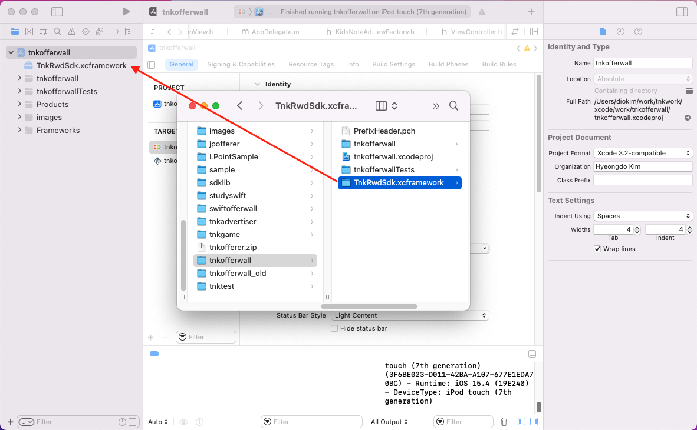
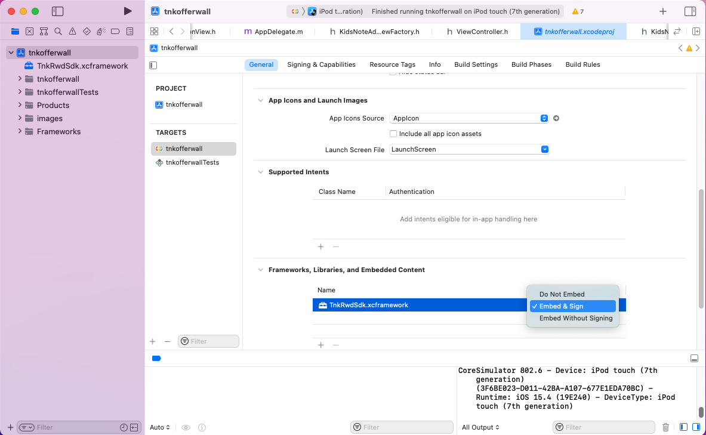

##### Migration

If you applied the existing lib file, please delete libtnksdk.a and tnksdk.h header file.

And please modify the code, wrote with #import "tnksdk.h" to #import <TnkRwdSdk/TnkRwdSdk.h>.

**Cautions) App Store policy does not accept application compensation advertisements if they are exposed.** 
**If you use it as a reward type, you need to set up the app before the app store inspection so that app ads are not exposed, so please contact us in advance and we will guide you.**

##### add "Privacy - Tracking Usage Description" info.plist Additional phrases are exposed in app tracking consent pop-up screen.

###### Example

**Ad_ID are collected to provide appropriate advertisements to users and to check their participation. Advertising ID is an essential item to provide offer wall service and can be used only if you allow tracking**

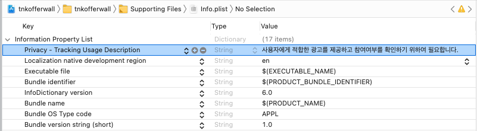

##### Add SKAdNetwork ID list in info.plists. This is for iOS 14, you can find more information in the link below.

[Configuring the Participating Apps](https://developer.apple.com/documentation/storekit/skadnetwork/configuring_the_participating_apps)

```
<key>SKAdNetworkItems</key>
<array>
  <dict>
    <key>SKAdNetworkIdentifier</key>
    <string>2U9PT9HC89.skadnetwork</string>
  <dict/>
  <dict>
    <key>SKAdNetworkIdentifier</key>
    <string>44jx6755aq.skadnetwork</string>
  <dict/>
  <dict>
    <key>SKAdNetworkIdentifier</key>
    <string>4FZDC2EVR5.skadnetwork</string>
  <dict/>
  <dict>
    <key>SKAdNetworkIdentifier</key>
    <string>4PFYVQ9L8R.skadnetwork</string>
  <dict/>
  <dict>
    <key>SKAdNetworkIdentifier</key>
    <string>737z793b9f.skadnetwork</string>
  <dict/>
  <dict>
    <key>SKAdNetworkIdentifier</key>
    <string>7UG5ZH24HU.skadnetwork</string>
  <dict/>
  <dict>
    <key>SKAdNetworkIdentifier</key>
    <string>8s468mfl3y.skadnetwork</string>
  <dict/>
  <dict>
    <key>SKAdNetworkIdentifier</key>
    <string>9RD848Q2BZ.skadnetwork</string>
  <dict/>
  <dict>
    <key>SKAdNetworkIdentifier</key>
    <string>9T245VHMPL.skadnetwork</string>
  <dict/>
  <dict>
    <key>SKAdNetworkIdentifier</key>
    <string>av6w8kgt66.skadnetwork</string>
  <dict/>
  <dict>
    <key>SKAdNetworkIdentifier</key>
    <string>c6k4g5qg8m.skadnetwork</string>
  <dict/>
  <dict>
    <key>SKAdNetworkIdentifier</key>
    <string>CJ5566H2GA.skadnetwork</string>
  <dict/>
  <dict>
    <key>SKAdNetworkIdentifier</key>
    <string>F38H382JLK.skadnetwork</string>
  <dict/>
  <dict>
    <key>SKAdNetworkIdentifier</key>
    <string>GLQZH8VGBY.skadnetwork</string>
  <dict/>
  <dict>
    <key>SKAdNetworkIdentifier</key>
    <string>hs6bdukanm.skadnetwork</string>
  <dict/>
  <dict>
    <key>SKAdNetworkIdentifier</key>
    <string>mlmmfzh3r3.skadnetwork</string>
  <dict/>
  <dict>
    <key>SKAdNetworkIdentifier</key>
    <string>prcb7njmu6.skadnetwork</string>
  <dict/>
  <dict>
    <key>SKAdNetworkIdentifier</key>
    <string>T38B2KH725.skadnetwork</string>
  <dict/>
  <dict>
    <key>SKAdNetworkIdentifier</key>
    <string>TL55SBB4FM.skadnetwork</string>
  <dict/>
  <dict>
    <key>SKAdNetworkIdentifier</key>
    <string>W9Q455WK68.skadnetwork</string>
  <dict/>
  <dict>
    <key>SKAdNetworkIdentifier</key>
    <string>wg4vff78zm.skadnetwork</string>
  <dict/>
  <dict>
    <key>SKAdNetworkIdentifier</key>
    <string>YCLNXRL5PM.skadnetwork</string>
  <dict/>
  <dict>
    <key>SKAdNetworkIdentifier</key>
    <string>ydx93a7ass.skadnetwork</string>
  <dict/>
    <dict>
    <key>SKAdNetworkIdentifier</key>
    <string>gvmwg8q7h5.skadnetwork</string>
  <dict/>
</array>
```

### Processing flow for offer

#### When you first use the offerwall, the app tracking consent pop-up will be displayed as shown below. App tracking consent is a method provided by iOS 14, and IDFA can be collected if the user agrees here

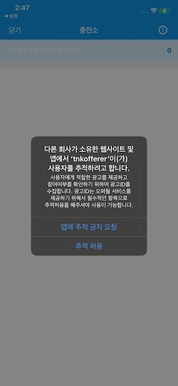

#### Users who refuse to agree to follow the app will be prompted to disable the offerwall.

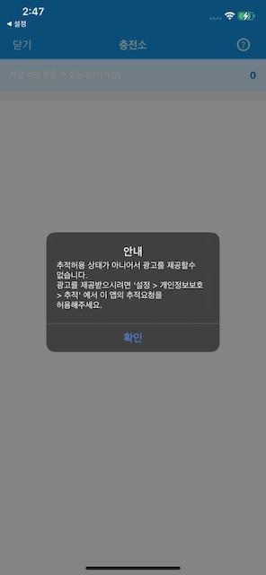

#### Tracking app ads lists, only to users who agree that.

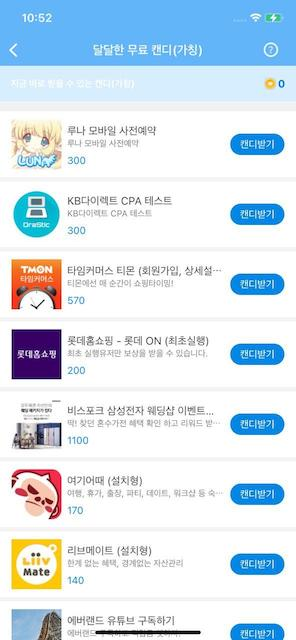

#### Install/action-type ads must be approved by the user to track the app even in the ads app installed. also we have set up an information pop-up before moving to the app store

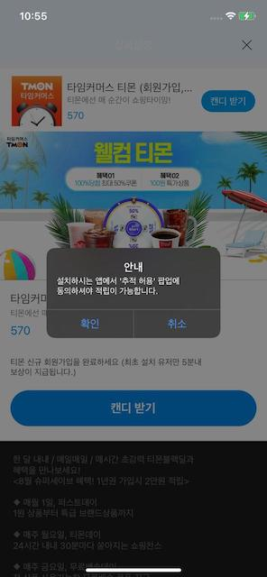

### Initialize Tnk Object


Initialize the TnkSession object before adding the TnkAd SDK. TnkSession initialization provides two methods: can proceed by selecting one of the two methods below.

#### To invoke the initialization API

Please put the initialization logic in the applicationDidFinishLaunchingWithOption method in the Application Delegate

**You can get the APP_ID by registering the app on the TNK site. must put this value in your-application-id-from-tnk-site part of the initialization logic below.**

```objective-c
#import "tnksdk.h"

- (BOOL)application:(UIApplication *)application didFinishLaunchingWithOptions:(NSDictionary *)launchOptions
{
    // Tnk initial
    [TnkSession initInstance:@"your-application-id-from-tnk-site"];

    // ...
}
```

#### Update App_ID in info.plist

Locate the info.plist file for the Xcode project, add the "tnkad_app_id" entry, and set the APP_ID value as shown below. When set here, the TnkSession object is automatically initialized when it is first used.

 **You can get the APP_ID value by registering the app on the Tnk site. Set this to the value entry as shown in the screen below.**


### App Transport Security Settings

Starting from SDK v4.05, all communication will be via HTTPS, so you do not need to set up ATS related settings below
However, in case of SDK v4.04 or lower, the following contents must be set in the app's plist file for SDK to work properly in iOS 9.
NSAppTransportSecurity Dictionary with the key sets a tnkfactory.com in the lower value by registering a NSExceptionDomains. 

For more information below gives an example.

#### iOS 9 App Transport Security Settings

```xml
<key>NSAppTransportSecurity</key>
<dict>
<key>NSExceptionDomains</key>
<dict>
<key>tnkfactory.com</key>
<dict>
<key>NSIncludesSubdomains</key>
<true/>
<key>NSExceptionRequiresForwardSecrecy</key>
<false/>
<key>NSExceptionAllowsInsecureHTTPLoads</key>
<true/>
</dict>
 </dict>
</dict>
```


## 2. Publisher API

This is a guide for the publishing app.

To do this, registration of the app on the Tnk site and [SDK Get Stared](#1-SDK-Get-Stared) of the XCode must be preceded


Implementing apps by applying Tnk's SDK consists of 3 steps.

1) Register app and information on the TNK site

2) Implement button to go to Tnk charging station

3) Check up and use user charged points

### A. Show ads list

You have to registe, test device to develop a list of ads appeared

#### Setup user identification

The app is launched, please first set the unique ID that identifies the user to the Tnk SDK using the API below.
You can use the game's login ID as the user identification, and if you do not have an appropriate value, you can use the Device ID value, etc.
(If the user identification value corresponds to personal information such as Device ID, phone number, or email, please encrypt and set it.)
You need to set the user identification value so that you can receive the points that you have accumulated when you call back the developer's server.

##### Method

- (void) setUserName : (NSString *) userName

##### Parameters

| Name | Description                                                         |
| ------------- | ------------------------------------------------------------ |
| userName      | The app uses in order to identify their id (such as login id) is less than 256 bytes values. |

##### Example

```objective-c
[[TnkSession sharedInstance] setUserName:loginId];
```

#### TnkSession - showAdList~:title

Use the showAdListAsModel:title or showAdListNavigation:title method of the TnkSession object to display the ads list in your app.
It displays a list of ads in the form of a modal view or a navigation controller.

##### Method

- (void) showAdListAsModal: (UIViewController *) viewController title: (NSString *) title
- (void) showAdListNavigation: (UIViewController *) viewController title: (NSString *) title

##### Description

The method provided by the TnkSession class displays the ads list screen. TnkSession's sharedInstance object must be received and the method must be invoked, either in the form of a modal view (showAdListAsModal) or at a lower level of the navigation controlle(showAdListNavigation). 

##### Parameters

| Name  | Description                          |
| -------------- | ----------------------------- |
| viewController | Current view of  screen controller object   |
| title          | Title of the ads list |


##### Example

```objective-c
- (IBAction)showOfferListPressed:(id)sender {
    // Floating ads into the modal window
    [[TnkSession sharedInstance] showAdListAsModal:self title:@"free gold charge"];
}
```

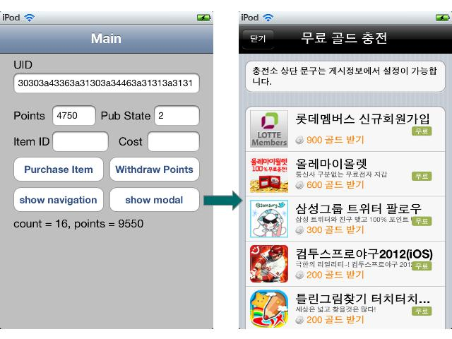

#### TnkAdListView

TnkAdListView is a UIView object that provides a reward ads list. It is provided in UIView, so you can load the ads list more flexibly in the app.

##### TnkAdListView interface

```objective-c
@interface TnkAdListView : UITableView <UITableViewDelegate, UITableViewDataSource, UIAlertViewDelegate, TnkServiceCallback, UIGestureRecognizerDelegate>

- (id) initWithFrame:(CGRect)frame viewController:(UIViewController *)vc;
- (void) loadAdList;
- (void) updateAdList;
- (NSTimeInterval) getLastLoadingSeconds;

@end
```

Create TnkAdListView

- (id) initWithFrame: (CGRect) frame viewController: (UIViewController *) vc;

Parameter passing as the object the size and UIViewController TnkAdListView to create The methods are provided by TnkAdListView

  - (void) loadAdList;
      - Receive a list of ads from the server and display that on the screen.
      
  - (void) updateAdList;
      - Shows the current ads list back on the screen. No new ads are requested from the server.
      - Use it to show the ads list back on the screen when the size or direction of the screen changes.
      
  - (NSTimeInterval) getLastLoadingSeconds;    
      - Finally, requested an ad on the server time returns to (second) early in terms of 1970.1.1


The example below shows a TestAdListViewController source implemented using TnkAdListView.

##### AdTitleView Source

```objective-c
// AdTitleView.h
#import <UIKit/UIKit.h>

@interface AdTitleView : UIView

@property (nonatomic, weak) IBOutlet UIButton* closeButton;
@property (nonatomic, weak) IBOutlet UIButton* helpButton;
@property (nonatomic, weak) IBOutlet UILabel *titleLabel;

- (IBAction) didHelpButtonPressed:(id)sender;

@end

// AdTitleView.m
#import "AdTitleView.h"
#import "TnkSession.h"

@implementation AdTitleView


- (IBAction) didHelpButtonPressed:(id)sender {
    NSString *url = [[TnkSession sharedInstance] getHelpdeskUrl];
    NSURL *urlToOpen = [NSURL URLWithString:[NSString stringWithString:url]];
   
    [[UIApplication sharedApplication] openURL:urlToOpen];
}

@end
```

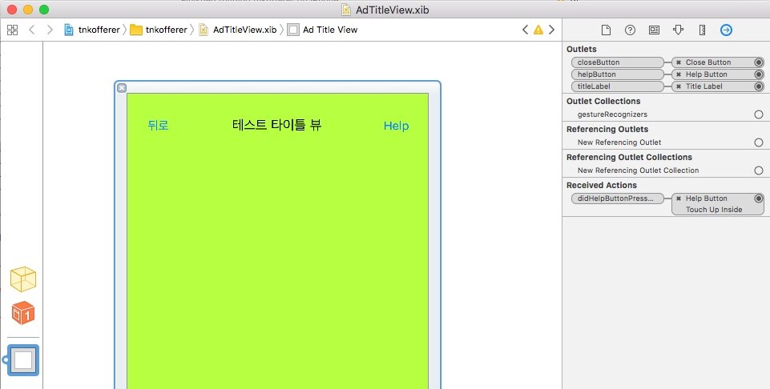

##### TestAdListViewController

```objective-c
// TestAdListViewController.h
#import <UIKit/UIKit.h>

@interface TestAdListViewController : UIViewController 

@end

// TestAdListViewController.m
#import "TestAdListViewController.h"
#import "AdTitleView.h"
#import "tnksdk.h"

#define HEADER_HEIGHT 60

@interface TestAdListViewController ()

@end

@implementation TestAdListViewController {
    AdTitleView *titleView;
    TnkAdListView *adlistView;
}

- (void) cancelPressed {
    [self.navigationController popViewControllerAnimated:YES];
}

- (void)viewDidLoad {
    [super viewDidLoad];
    // Do any additional setup after loading the view.

    titleView = (AdTitleView *)[[[NSBundle mainBundle] loadNibNamed:@"AdTitleView" owner:self options:nil] objectAtIndex:0];
    titleView.frame = CGRectMake(0, 0, self.view.bounds.size.width, HEADER_HEIGHT);
    titleView.autoresizingMask = UIViewAutoresizingFlexibleWidth;

    [titleView.closeButton addTarget:self action:@selector(cancelPressed) forControlEvents:UIControlEventTouchUpInside];

    [self.view addSubview:titleView];

    CGRect rect = CGRectMake(0, HEADER_HEIGHT, self.view.bounds.size.width, self.view.bounds.size.height - HEADER_HEIGHT);
    adlistView = [[TnkAdListView alloc] initWithFrame:rect viewController:self];
    adlistView.autoresizingMask = UIViewAutoresizingFlexibleWidth | UIViewAutoresizingFlexibleHeight;

    [self.view addSubview:adlistView];
}

- (void)viewWillAppear:(BOOL)animated
{
    [super viewWillAppear:animated];

    [adlistView loadAdList];
}

- (void)didReceiveMemoryWarning {
    [super didReceiveMemoryWarning];
    // Dispose of any resources that can be recreated.
}

- (BOOL)shouldAutorotateToInterfaceOrientation:(UIInterfaceOrientation)interfaceOrientation
{
    return UIInterfaceOrientationIsPortrait(interfaceOrientation);
}

- (void)didRotateFromInterfaceOrientation:(UIInterfaceOrientation)fromInterfaceOrientation {

    if (!self.isViewLoaded || !self.view.window) {
        // Ignore it if it's not on the current screen.
        return;
    }

    [adlistView updateAdList];
}

- (void)viewWillTransitionToSize:(CGSize)size
       withTransitionCoordinator:(id<UIViewControllerTransitionCoordinator>)coordinator {

    if (!self.isViewLoaded || !self.view.window) {
        // Ignore it if it's not on the current screen.
        return;
    }

    [coordinator animateAlongsideTransition:^(id<UIViewControllerTransitionCoordinatorContext> context)
     {
         // do whatever
     } completion:^(id<UIViewControllerTransitionCoordinatorContext> context)

     {
         [adlistView updateAdList];
     }];

    [super viewWillTransitionToSize:size withTransitionCoordinator:coordinator];
}

@end
```

### B. Point check and withdrawal

Points acquired by users through ads participation can be managed by the TNK server or by the app's yours server.
If the points are managed by the TNK server, you can use the following point check and withdrawal API to implement the required item purchase method.

#### TnkSession - queryPoint

Check user points accumulated on the Tnk server. you must call the object with the sharedInstance of the TnkSession.
There are two types of calling methods synchronous and asynchronous, and it is recommended to use the asynchronous method to ensure that there is no screen pause.
In addition, it doesn't matter if you create thread and call it synchronously.

##### [call asynchronous]

###### Method 

  - (void) queryPoint: (id) target action: (SEL) action;

###### Description

Check the points users who have accumulated on the server Tnk. Asynchronous way of the object is called the results, action of target object is recalled. 

###### Parameters

| Name | Description                                                         |
| ------------- | ------------------------------------------------------------ |
| target        | When the result is received, the action method of this object is called            |
| action        | Specifies the method to be called when the result is received. current point value is passed to the parameter when the method is called, the method defines that it can receive one parameter (NSNumber*). |

###### Example

```objective-c
- (void) pointReceived:(NSNumber *)point {
    [self.userPoints setText:[point stringValue]]; 
}

- (void)viewWillAppear:(BOOL)animated
{
    [super viewWillAppear:animated];

    // Inquiry the current points. (asynchronous method call)
    [[TnkSession sharedInstance] queryPoint:self action:@selector(pointReceived:)];
```

##### [call synchronous]

###### Method 

  - (NSInteger) queryPoint;

###### Description

Query user point values accumulated on the Tnk server. returns the value of the point called synchronously and queried.

###### Return

  - Point value accumulated on Tnk server (NSInteger)

###### Example

```objective-c
NSInteger userPoint = [[TnkSession sharedInstance] queryPoint];
```

#### TnkSession - purchaseItem

The TnK server does not provide the ability to manage the list of items.
However, when a user purchases an item provided by the posting app, you can deduct the corresponding point to the Tnk server. TnkSession's sharedInstance requires you to retrieve and recall objects and operates asynchronously.

###### Method 

  - (void) purchaseItem: (NSString *) itemId cost: (NSInteger) poinCost target: (id) target action: (SEL) action;

###### Description

Accumulated on the server Tnk the user points. The deduction Tnk can inquire on the report page on site.

###### Parameters

| Name | Description                                                         |
| ------------- | ------------------------------------------------------------ |
| itemId        | Items to purchase unique id (to those prescribed in the app publishing id) tnk page shows together in the report of the site. |
| pointCost     | Points to be deducted                                               |
| target        | When the result is received, the action method of this object is called.          |
| action        | Specifies the method to be called when the result is received. Two NSNumber objects are received as parameters, and the remaining point values after deduction are delivered to the first parameter, and the unique transaction Id value is delivered to the second parameter. If the purchase is not performed due to a lack of points or a network/system error, a negative number is transmitted to the second parameter value. |

###### Example

```objective-c
- (void) purchaseResultReceived:(NSNumber *)pointRemain transactionId:(NSNumber *)trId {
    [self.userPoints setText:[pointRemain stringValue]];

    if ([trId integerValue] < 0) {
        // error
        UIAlertView *viewAlert = [[UIAlertView alloc] initWithTitle:@"purchaseItem Error" 
                                                            message:@"purchase Error!!!"
                                                           delegate:nil 
                                                  cancelButtonTitle:@"Confirm" 
                                                  otherButtonTitles:nil];

        [viewAlert show];
        [viewAlert autorelease]; 
    }
    else {
        // success
        UIAlertView *viewAlert = [[UIAlertView alloc] initWithTitle:@"purchaseItem Success" 
                                                            message:[trId stringValue]
                                                           delegate:nil 
                                                  cancelButtonTitle:@"Confirm" 
                                                  otherButtonTitles:nil];

        [viewAlert show];
        [viewAlert autorelease]; 
    }
}

- (IBAction)purchaseItemPressed:(id)sender {
    // Use points such as purchasing items as charged points
    NSInteger pointCost = [self.itemCost.text integerValue];
    [[TnkSession sharedInstance] purchaseItem:self.itemId.text 
                                                                cost:pointCost 
                                                             target:self 
                                                           action:@selector(purchaseResultReceived:transactionId:)];
}
```

#### TnkSession - withdrawPoints

Ability to withdraw all managed user points from the Tnk server

###### Method 

  - (void) withdrawPoints: (NSString *) desc target: (id) target action: (SEL) action;

###### Description

Deducts all points of the user accumulated on the Tnk server and returns the deducted point value. you can inquire the deduction details on the report page of the Tnk site.

###### Parameters

| Name | Description                                                         |
| ------------- | ------------------------------------------------------------ |
| desc          | Include explanations related to withdrawal. It is displayed together on the report page of the Tnk site |
| target        | If you get the results of these objects action of the method is called.         |
| action        | Specifies the method to be called when the result is received. NSNumber objects are received as two parameters, and the remaining point values after deduction are delivered to the first parameter, and the unique transaction Id value is delivered to the second parameter. If the purchase is not performed due to a lack of points or a network/system error, a negative number is transmitted to the second parameter value. |

###### Example

```objective-c
- (void) withdrawPointsReceived:(NSNumber *)points {
    NSLog(@"WithdrawPointsReceived %d", [points intValue]);
}

- (IBAction) didWithdrawButtonPressed:(id)sender {    
    [[TnkSession sharedInstance] withdrawPoints:@"test" target:self action:@selector(withdrawPointsReceived:)];
}
```

### C. Others Method

#### TnkSession - queryPublishState

If you stop posting ads in [Post Information] on the Tnk site, the ads will not appear even if the user displays the ads list window.
Therefore, it is recommended that the charging station button itself is not visible on the screen in case you stop posting ads in the future.
To this end, it provides a method to inquire the status of the ads posting of the current publishing app.

##### [call Asynchronous]

###### Method 

  - (void) queryPublishState: (id)target action: (SEL) action;

###### Parameters

| Name | Description                                                         |
| -------------------------- | --------------------------------------------------- |
| target | When the result is received, the action method of this object is called            |
| action | Specifies the method to be called when the result is received. the current publishing state value is passed to the parameter at the time of method invocation, the method is defined to receive one (NSNumber*) parameter. refer to the "tnksdk.h" file for transmitted state values. |

###### Example

```objective-c
- (void) publishStateReceived:(NSNumber *) state {
    // Display or hide the charging station movement button depending on the status value.
    if ([state integerValue] == TNK_STATE_YES) {
        // Show Ad List button
    }
    else {
        // Ads inventory hide buttons.
    }
}

- (void)viewWillAppear:(BOOL)animated
{
    [super viewWillAppear:animated];

    // Posting app status check (Asynchronous method call).
    [[TnkSession sharedInstance] queryPublishState:self action:@selector(publishStateReceived:)];
}
```

##### [call Asynchronous]

###### Method

- (NSInteger) queryPublishState;

###### Return

- Returns the current publishing status value. (tnksdk.h reference) 

#### TnkSession - queryAdvertiseCount

It's good enough to check the status of an ads post to make the charging station button visible or invisible, but even if it's currently posted, there may be no ads that can't be paid to you. Therefore, it is more desirable to determine whether there are any ads that can be accumulated at present and expose the buttons.
To this end, we provide the method to check the advertisement information that can be accumulated as follows.

##### Method 

  - (void) queryAdvertiseCount: (id) target action: (SEL) action;

##### Parameters

| Name   | Discription                                                  |
| ------ | ------------------------------------------------------------ |
| target | When the result is received, the action method of this object is called |
| action | Specifies the method to be called when the result is received. Two NSNumber objects are passed as parameters when the method is called. The first parameter contains the number of ads currently available, and the second parameter contains the total number of points available |

##### Example

```objective-c
- (void) adCountReceived:(NSNumber *)count point:(NSNumber *)point {
    if ([point integerValue] > 0) {
        // Show Ad List button
    }
    else {
        // Ads Inventory Hide buttons.
    }
}

- (void)viewWillAppear:(BOOL)animated
{
    [super viewWillAppear:animated];

    // Posting app status check (asynchronous method call).
    [[TnkSession sharedInstance] queryAdvertiseCount:self action:@selector(adCountReceived:point:)];
}
```

### D. Settings Style

You can use the basic style provided by SDK for the ads list, but you can define the style to be consistent with the app's UI.

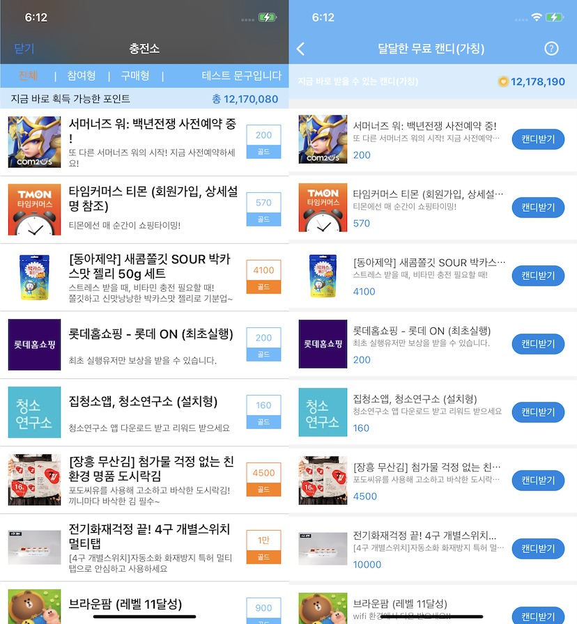

Tnk SDK are going to set up the ads and detailed list of the screen can change color and image following a API. 
All API TnkSession's sharedinstance of the call should be using the object obtained by invoking.

(** Please TableStyle should be stayed UITableStylePlain if you designate style)

#### Settings Ads List Style

- (void) setBackgroundColor:(UIColor *)color; // Background color used globally

- (void) setHeaderTitle:(NSString *)title; // Title phrases displayed at the top of the ads list (navigation bar)
- (void) setHeaderColor:(UIColor *)color; // Top Title Phrase Background Color
- (void) setHeaderTextColor:(UIColor *)color; // Top Title Phrase Color

- (void) setHeaderHelpButtonImage:(UIImage *)image; // Image for displaying the Contact button at the top of the ad list
- (void) setHeaderCloseButtonImage:(UIImage *)image; // Image for Close button when ad list is floated as Modal
- (void) setHeaderButtonTintColor:(UIColor *)color; // The text color of the Close button in the ad list

- (void) setListItemBackgroundColorNormal:(UIColor *)color; // List Background Color
- (void) setListItemBackgroundColorStripe:(UIColor *)color; // Specify if the background color of the odd-numbered line of the list is different
- (void) setListItemBackgroundColorHighlight:(UIColor *)color; // Color when the list is pressed

- (void) setTagNormalColor:(UIColor *)color;  // Point display area of ads item : basic color
- (void) setTagConfirmColor:(UIColor *)color; // Point display area of ads item : Color if installation confirmation status
- (void) setTagPurchaseColor:(UIColor *)color; // Point display area of ads items: Designated when purchasing type ads are different in color

- (void) setShowAdListFooter:(BOOL)yesno; // Contact bottom of ad list and display footer area for SDK version display, default YES

- (void) setAdListMenuTextColor:(UIColor *)color; // Ads list area section Heather's menu text color
- (void) setAdListMenuSelectedColor:(UIColor *)color; // Ads list area section Hader's menu text color (selected state)
- (void) setAdListMenuBackgroundColor:(UIColor *)color; // Ads list area section Heather's menu background color
- (void) setAdListSubMenuTextColor:(UIColor *)color; // Ads list area section Hader's submenu text color
- (void) setAdListSubMenuBackgroundColor:(UIColor *)color; // Ads list area section Hader's submenu background color
- (void) setAdListSubMenuPointColor:(UIColor *)color; // Character color for submenu point display in ads list area section Hadder
- (void) setAdListSubMenuPointDesc:(NSString *)title; // Customizing the phrase 'Points that can be obtained now' in the ads list area
- (void) setAdListSubMenuPointFormat:(NSString *)title; // Ads list area point display format string, %@ must be included

#### Settings Style of Ads Details screen

- (void) setDetailHeaderColor:(UIColor *)color; // Detailed screen navigation bar background color
- (void) setDetailHeaderTextColor:(UIColor *)color; // Detailed screen navigation bar text color
- (void) setDetailCloseButtonTintColor:(UIColor *)color; // Close button image or phrase color
- (void) setDetailCloseButtonImage:(UIImage *)image; // Image for close button on reward ads detail screen
- (void) setDetailCloseButtonRight:(BOOL)yesno; // Leave the close button to the right (default NO)

- (void) setDetailBackgroundColor:(UIColor *)color; // Default background color for a detail screen
- (void) setDetailTextColor:(UIColor *)color; // Details screen default character color
- (void) setDetailPointColor:(UIColor *)color; // Detailed screen point character color

- (void) setDetailButtonImageNormal:(UIImage *)image;  // Default image of the move detail button
- (void) setDetailButtonImageHighlight:(UIImage *)image; // Image when pressed on the move detail screen button
- (void) setDetailButtonTextColor:(UIColor *)color; // Text color of the move detail button
- (void) setDetailButtonLabel:(NSString *)label; // Move button statement

#### Customizing

- If you are implementing the design of the screen on your app, rather than simply changing the color or button image, you can set the Factory class below to implement it. Please contact us separately on how to implement the Factory class.

- (void) setAdItemViewFactory:(AdListItemViewFactory *)factory; // Ads item list of view, for an object was created.
- (void) setAdListSectionHeaderView:(UIView *)view; // Ads in the area of list Section header the settings to show for their screen view

#### Example

```objective-c
- (void) setOfferwallStyle {
    
    //
    // Common Settings
    //
    [TnkSession sharedInstance].adListNavigationBarStyle = UIBarStyleBlack;
    [TnkSession sharedInstance].adDetailNavigationBarStyle = UIBarStyleDefault;
    
    // Setting up the buttons as shown below in order to expose image to inquire at the top of the offerwall.
    [TnkSession sharedInstance].headerHelpButtonImage = [UIImage imageNamed:@"kidsnote_helpdesk"];
    // Contact at the bottom of the offerwall to area have set as shown below, to hide.
    [TnkSession sharedInstance].showAdListFooter = NO;
    
    // Offerwall detail screen Navigation bar background color
    [TnkSession sharedInstance].detailHeaderColor = [UIColor colorWithRed:(235)/255.0f
                                                                    green:(246)/255.0f
                                                                     blue:(255)/255.0f
                                                                    alpha:(255)/255.0f];
    [TnkSession sharedInstance].detailHeaderTextColor = [UIColor blackColor];
    
    // The icon color of the nebigeisyeonba should be set separately.
    [TnkSession sharedInstance].detailCloseButtonTintColor = [UIColor blackColor];
    
    // Close button image on the offerwall detail screen
    [TnkSession sharedInstance].detailCloseButtonImage = [UIImage imageNamed:@"kidsnote_detail_close"];
    // Place the close button on the offer wall detail screen to the right.
    [TnkSession sharedInstance].detailCloseButtonRight = YES;
    // A statement detailed the movement buttons on the screen offerwall
    [TnkSession sharedInstance].detailButtonLabel = @"캔디 받기";
    
    // Section for "points that can get right now" in the area header offerwall custom view setup.
    KidsNoteAdListHeaderView *headerView = (KidsNoteAdListHeaderView *)[[[NSBundle mainBundle]               loadNibNamed:@"KidsNoteAdListHeaderView" owner:self options:nil] objectAtIndex:0];
    headerView.frame = CGRectMake(0, 0, self.view.bounds.size.width, HEADER_HEIGHT);
    headerView.autoresizingMask = UIViewAutoresizingFlexibleWidth;
    
    [TnkSession sharedInstance].adListSectionHeaderView = headerView;
    
    // Remove separation lines between list items
    [TnkSession sharedInstance].tableViewSeparatorStyle = UITableViewCellSeparatorStyleNone;
    
    // setup a Factory object to create a customized View.
    [TnkSession sharedInstance].adItemViewFactory = [[KidsNoteAdListItemViewFactory alloc] init];
    
    // To a request for total points to a server check.(Every call, if necessary updated points)
    [[TnkSession sharedInstance] queryAdvertiseCount:self action:@selector(adCountReceived:point:)];
    
}
```


### E. Callback URL

If the user manages the points obtained through ads participation on the developer's server, proceed as follows.

* On the app Information Settings screen, select the 'Point Management' item as 'Manage from your own server' as shown below.
* In URL entry, enter the URL to receive point accumulation information.

After that, the user can receive the accumulation information at the URL above in real time whenever the points are accumulated.

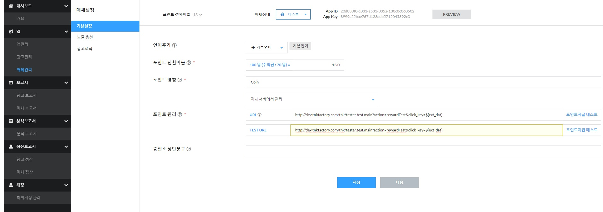

##### Call Method

HTTP POST

##### Parameters

| Name   | Description                                                  | Max length |
| ---------- | ------------------------------------------------------------ |---- |
| seq_id     | It is a unique ID value for point payment. Even if the URL is repeatedly called, this value can be used to check the redundancy benefit book | string(50) |
| pay_pnt    | It is a point value to be paid to the user                   | long |
| md_user_nm | It is a value transmitted to identify a user in a posting application. In order to receive this value, the user identification value must be set using the setUserName() API within the media app | string(256) |
| md_chk     | It is provided to determine whether the transmitted value is valid. The value is an MD5 Hash value of app_key+md_user_nm+seq_id. The app_key value can be checked on the Tnk site as a value assigned when registering the app. | string(32) |
| app_id     | Unique ID value of the advertising app                   | long |
| pay_dt     | Point payment time (System milliseconds) 예) 1577343412017 | long |
| app_nm     | It is the name of the advertisement that participated.                                         |  string(120) |
|pay\_amt|the amount to be settled|long|
|actn\_id|- 0 : CPI<br />- 1 : CPE<br />- 2 : CPA<br />- 5 : CPS|int|

##### Processing Return Value

Tnk server calls the above URL and determines that it has been processed normally when 200 is returned to the HTTP return code.
If a value other than 200 is returned, the Tnk server determines that it is abnormal and then repeatedly calls every 5 minutes and 1 hour for up to 24 hours.

* Cautions! same request can be repeatedly called, so you must double check using the seq_id value.

##### Callback URL Example

```java
// Points paid to that user

int payPoint = Integer.parseInt(request.getParameter("pay_pnt"));

// Unique number generated inside the tnk id.

String seqId = request.getParameter("seq_id");

// It is used to determine whether the transmitted parameters are valid or not. (See Coding Below)

String checkCode = request.getParameter("md_chk");

// The used (phone numbers or login id) value used in the app for posting tnksession setUserName() is set to to be after.

String mdUserName = request.getParameter("md_user_nm");

// App_key granted when registering the app (can be checked on tnk site)

String appKey = "d2bbd...........19c86c8b021";

// To create verifycode as the order to verify the validity.The DigestUtils는 apache commons - codec.jar this necessary. If safe to use it. There is a different hash method for the md2

String verifyCode = DigestUtils.md5Hex(appKey + mdUserName + seqId);

// If the generated verifyCode and chk_cd parameter values do not match, this is an invalid request

if (checkCode == null || !checkCode.equals(verifyCode)) {

    // error

    log.error("tnkad() check error : " + verifyCode + " != " + checkCode);

} else {

    log.debug("tnkad() : " + mdUserName + ", " + seqId);


    //Perform logic to grant points (example)

    purchaseManager.getPointByAd(mdUserName, payPoint, seqId);

}
```
